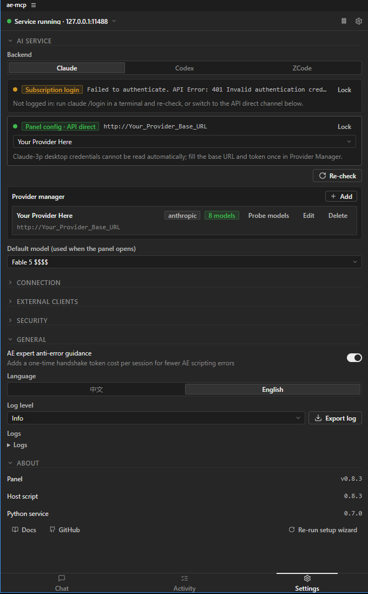
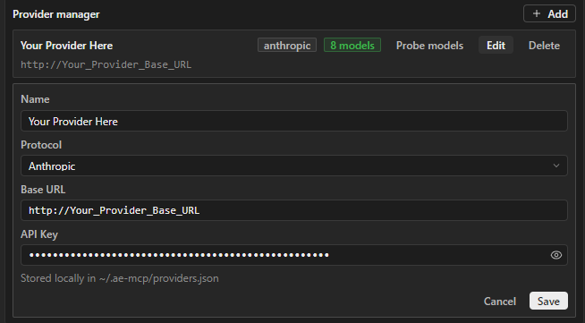
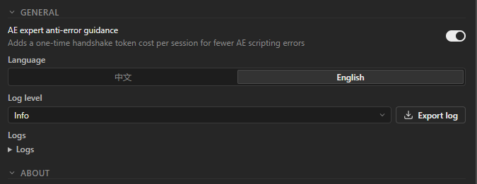
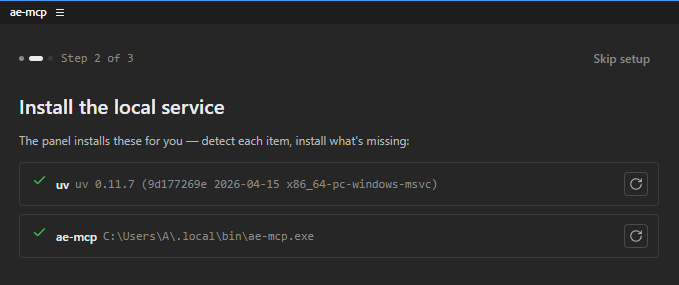
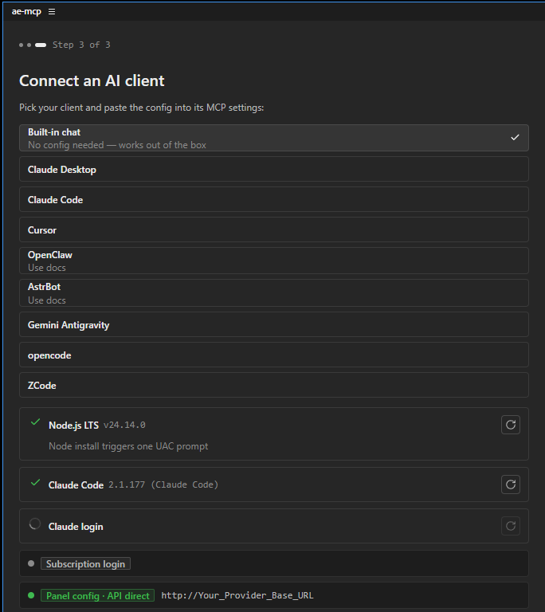
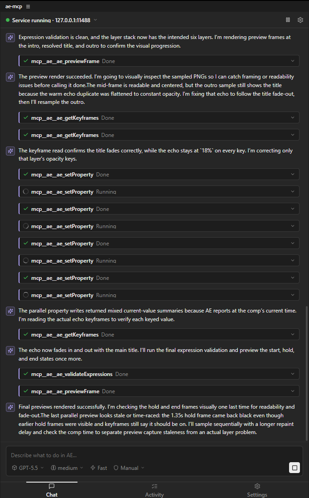
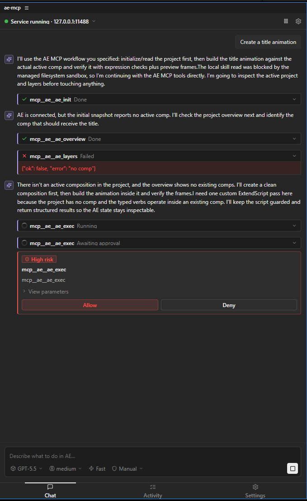
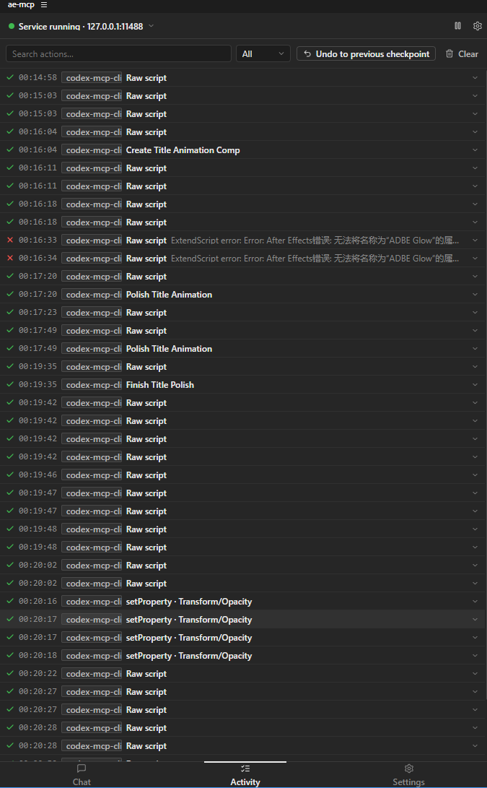

# ae-mcp

English | [简体中文](README.zh-CN.md)

ae-mcp is a backend-agnostic automation tool that keeps Adobe After Effects and AI agents in the same working context. Its MCP server exposes AE project state, tool execution, previews, screenshots, and checkpoints so an agent can understand and operate the current AE project during a conversation.

The MCP server is the core. Outside the MCP layer, ae-mcp also ships a CEP panel that wraps built-in agent chat, backend configuration, approval controls, diagnostics, and first-run setup. You can use ae-mcp from an external agent backend through MCP, or configure Claude / Codex / ZCode directly inside the AE panel.

**v0.9.2 is the Windows x64 release.** macOS compatibility, bundled RuntimeManager, the production cross-platform signing chain, and the complete AE 25/26 hardware matrix move to v0.9.3.

## v0.9.2 Target Support Matrix

The published v0.9.2 asset targets this verified release scope:

- Windows 11 24H2 (11.0.26100) or newer on x64. Windows on ARM is not supported.
- After Effects 25.x is hardware-validated. The CEP manifest remains `[25.0,26.9]`; complete AE 26 and macOS acceptance is deferred to v0.9.3.

## Architecture

```text
Embedded panel chat or external MCP client
  -> packages/core (ae_mcp, Python stdio MCP server, 51 ae_ tools)
  -> backend (packages/bridge, httpx)
  -> CEP panel Node host (plugin/host, Express, 127.0.0.1:11488)
     -> native RPC -> AEGP main-thread dispatcher
     -> CSInterface.evalScript -> ExtendScript (legacy JSX tools)
  -> After Effects
```

`ae_previewFrame` renders real comp pixels through `CompItem.saveFrameToPng`, with viewer snapshot only as a fallback. `packages/snapshot-mss` provides the cross-platform `mss` screenshot backend for `ae_snapshot` screen capture.

The MCP core is backend-agnostic: external clients can talk to AE through the stdio server, while the CEP panel can also host built-in agent chat. The existing panel layer handles backend setup, approvals, diagnostics, and activity history. The final v0.9.2 contract additionally requires first-run bundled-runtime verification, but that RuntimeManager behavior remains gated and is not claimed as delivered. Claude, Codex, and ZCode are built-in panel backends; OpenCode and other tools can still connect as external MCP clients.

## v0.9.2 Release Candidate Scope

- One protected `main` candidate SHA produces both native platform payloads; a failed or changed candidate must be rebuilt under a new SHA.
- Core operation is designed to be offline and self-contained in the signed release payload. System Python, system Node, `uv`, PyPI, and npm resolution are development inputs, not normal-user install prerequisites.
- Provider, Tool Library, and Platform Helper implementation is complete, including Windows AE 2025 hardware validation. v0.9.2 ships a self-signed Windows ZXP whose certificate is valid until 2037; the asset has no TSA timestamp, and its native Helper binaries are not Authenticode-signed. Bundled RuntimeManager, production native signing, macOS, and the remaining hardware cells are v0.9.3 work.
- UXP, Intel Mac, Windows ARM, provider-config export, and ZCode desktop captcha/runtime-header bridging are outside the v0.9.2 support scope.

## Install and First Run

Normal users install one immutable asset from the v0.9.2 release set. Do not use source archives or an online `uv`/PyPI install as a substitute for a signed release asset:

| Platform | Install asset | Auditable payload |
|---|---|---|
| Windows 11 24H2+ x64 | `ae-mcp-panel-v0.9.2-windows-x64.zxp` | same ZXP |

Install `ae-mcp-panel-v0.9.2-windows-x64.zxp` with a supported ZXP installer, restart After Effects, and open `Window -> Extensions -> ae-mcp`. This release retains the existing external runtime setup; the bundled offline RuntimeManager is deferred to v0.9.3.

The GitHub Release publishes the exact Windows asset and its SHA-256 digest. See [Install](docs/INSTALL.md) and [Release](docs/RELEASE.md).

## Built-in Backends

| Backend | What it is for | Setup |
|---|---|---|
| Claude | Use Claude from the panel through subscription login or API direct mode. | Optional channel dependency: Claude Code CLI (`claude`) and its login. API direct mode instead needs an Anthropic API key or compatible provider. |
| Codex | Use Codex from the panel through CLI login, inherited config, or an OpenAI-compatible provider. | Optional channel dependency: Codex CLI and `codex login`; provider mode does not require that CLI. |
| ZCode | Use ZCode providers from the panel. | Optional channel dependency: the ZCode CLI/app-server supplied by a supported ZCode installation. API-key providers remain separate. |

Claude Code CLI is separate from Claude Desktop. Claude Desktop MCP configuration is not reused by the embedded Claude backend. Codex has the same distinction: the panel either talks to Codex CLI state or to providers configured for ae-mcp.

## Panel Features

- Built-in chat with Claude, Codex, and ZCode.
- Composer controls for model selection, reasoning effort, fast mode, and approval mode. Model switching is session-local and does not clear the conversation.
- Four approval modes: read-only, manual, auto, and bypass. Tool annotations drive consistent behavior across backends; destructive/external Tool Library plans remain interactive even in bypass mode.
- Unified Provider Manager with expandable editable records for OpenAI-compatible and Anthropic providers.
- Activity stream for agent operations.
- Local Tools library for generated JSX, expressions, prompt skills, recipes, and diagnostics. Index/search responses stay summary-only; full content appears only after Inspect.
- Kill switch to stop all AI operations immediately.
- Current diagnostics cover host status, access token, Python client signal, AE project state, ExtendScript ping, and optional channel CLIs. Installed-runtime diagnostics belong to the gated RuntimeManager contract.
- Log export for issue reports and debugging.
- AE expert guidance injection. This optional setting adds AE command and data-structure guidance to reduce scripting mistakes at the cost of extra prompt tokens.

## Screenshots

<table>
  <tr><td><br>Settings: backend channels and compact Provider Manager rows</td><td><br>Settings: expanded provider editor with local API key storage</td></tr>
  <tr><td><br>Settings: general options, language switch, logs, and About</td><td><br>Historical v0.9.0 development wizard: online `uv` and PATH launcher setup; not the v0.9.2 bundled-runtime UX</td></tr>
  <tr><td><br>First-run wizard: built-in chat and external MCP client setup</td><td><br>Chat home: starter suggestions and composer controls</td></tr>
  <tr><td><br>Tool approval card for gated high-risk operations</td><td><br>Activity stream: agent operation history</td></tr>
</table>

## External MCP Clients

The final v0.9.2 panel-generated MCP config for external clients has this shape:

```json
{
  "mcpServers": {
    "ae": {
      "command": "/Users/<USER>/.ae-mcp/bin/ae-mcp",
      "env": {
        "AE_MCP_BACKEND": "ae-mcp",
        "AE_MCP_PLUGIN_URL": "http://127.0.0.1:11488"
      }
    }
  }
}
```

This is the final stable-launcher contract. Replace `<USER>` with the actual macOS account name; the final Panel generator must emit that expanded absolute path. On Windows, use the expanded absolute path for `%USERPROFILE%\.ae-mcp\bin\ae-mcp.exe`. The approved RuntimeManager implementation must replace the current Panel generator's bare PATH `ae-mcp`; the fail-closed native/product-acceptance build guard prevents publishing v0.9.2 while that mismatch remains.

External clients must run on the same machine as After Effects, or otherwise be able to reach `127.0.0.1:11488` on the AE machine. This matters for long-running or Dockerized IM-bot frameworks such as OpenClaw and AstrBot.

## Tool Surface

| Category | Tools |
|---|---|
| Project | `ae_init`, `ae_overview`, `ae_layers`, `ae_listProjectItems`, `ae_listCompositionLayers`, `ae_listSelectedLayers`, `ae_getCompositionTime`, `ae_listLayerProperties`, `ae_listLayerPropertyKeyframes`, `ae_setLayerPropertyValue`, `ae_readProps`, `ae_searchProject` |
| Mutation | `ae_exec`, `ae_applyEffect`, `ae_applyLayerEffect`, `ae_createLayer`, `ae_createComposition`, `ae_createCompositionLayer`, `ae_setProperty`, `ae_moveLayer`, `ae_selectLayers`, `ae_setTime` |
| Read-typed | `ae_getTime`, `ae_getProperties`, `ae_scanPropertyTree`, `ae_inspectPropertyCapabilities`, `ae_getExpressions`, `ae_validateExpressions`, `ae_getKeyframes` |
| Preview / capture | `ae_previewFrame`, `ae_snapshot` |
| Rigging | `ae_createRig` |
| Skill | `ae_skillList`, `ae_skillCreate`, `ae_skillEdit`, `ae_skillDelete`, `ae_skillUse` |
| Tools library | `ae_toolIndex`, `ae_toolSearch`, `ae_toolInspect`, `ae_toolUse`, `ae_toolCreate`, `ae_toolEdit`, `ae_toolDelete`, `ae_toolArchive`, `ae_toolDuplicate`, `ae_toolPromoteFromHistory`, `ae_toolImport`, `ae_toolExport` |
| Checkpoint | `ae_checkpoint`, `ae_revert` |
| Diagnostic | `ae_ping`, `ae_status`, `ae_diagnose` |

Expression workflows should run `ae_validateExpressions` before visual review. For risky edits, use `ae_checkpoint` or pass `checkpoint_label` to `ae_exec`.

### Local Tools library

The Tools tab stores native artifacts under `~/.ae-mcp/tools` and indexes existing `ae.skill*` files in place; it does not copy legacy skills or provide cloud sync. User and bundled same-name skills keep distinct Tool Library IDs, while `ae_skillUse` preserves its existing user-first resolution order. Successful generated JSX/expression calls may appear as non-executable history candidates. Imported `.aemcptools` packages also enter candidate state after quarantine, bounds, hash, schema, and secret scanning. Inspect candidate content before changing its status: history candidates use `ae_toolPromoteFromHistory`, while imported candidates use `ae_toolEdit` with `{"changes":{"status":"saved"}}`.

Discovery is progressive: call `ae_toolIndex`, then `ae_toolSearch`, then `ae_toolInspect`. Non-executing rendering uses `ae_toolUse(action="render")`; execute/apply operations use the content-bound prepare → grant → execute sequence. The plan binds the artifact and dependency hashes, normalized arguments, operation, target, risk, and expiry; grants are short-lived and one-time. Read-only denies writes, manual asks for writes, auto allows ordinary writes, and destructive/external plans always require a fresh decision even in bypass mode. Session approval is available only for write-risk plans and is bound to artifact content, operation, and normalized target rather than the tool name.

Give each side-effecting start/execute request a stable `operation_id` and reuse it only for retries of the same `planHash`. Concurrent Core clients sharing the Tool Library return the same queued/running/terminal execution for that pair, so only the reservation owner dispatches the backend; reusing the operation ID with another plan returns `tool_operation_conflict`. If an owner exits after dispatch, recovery becomes `outcome-unknown` with `inspect-state`; check AE state and audit evidence before using a new operation ID.

## Usage Notes

AI is not a finished-motion-design replacement. ae-mcp works best when you keep creative direction, taste, and final compositing judgment in human hands, while delegating repetitive operations, procedural animation, expression work, project cleanup, and refactoring of reusable AE structures.

For visual work, ask the agent to preview frames and verify intermediate results. For larger edits, create checkpoints so the project can return to a known good state.

## Development

Close every After Effects / AfterFX process before a development deployment. The CEP installer
preflights and stages the panel with its own backup flow. The native AEGP installer described
below independently verifies its artifact and returns a transaction ID for exact rollback.

### Native AEGP SDK input

The Adobe After Effects C/C++ Plug-in SDK is **not distributed with this repository** and
is never downloaded automatically. Developers must obtain the matching SDK from Adobe's
official [After Effects Developer page](https://developer.adobe.com/after-effects/) using
**Get the SDKs**, then extract it outside this checkout. The current native input lock is
After Effects SDK **25.6, build 61, 64-bit**:

| Platform | Expected outer archive | Bytes | SHA-256 |
|---|---|---:|---|
| macOS | `AfterEffectsSDK_25.6_61_mac.zip` | 2,039,255 | `c6abccd52ae25936b819b78c4fea2858bd161f216f72f75184fe9ec55a49756e` |
| Windows | `AfterEffectsSDK_25.6_61_win.zip` | 7,549,997 | `3d3a39175a09d07f6f9734284636f9eadce968b05161650e3cba097a95905330` |

Point `AE_SDK_ROOT` at the local extracted
`ae25.6_61.64bit.AfterEffectsSDK` directory (or its direct parent), and point
`AE_SDK_ARCHIVE` at the original outer archive. Before any native build, verify both the
archive identity and extracted layout/content:

```bash
export AE_SDK_ARCHIVE=/absolute/path/AfterEffectsSDK_25.6_61_mac.zip
export AE_SDK_ROOT=/absolute/path/ae25.6_61.64bit.AfterEffectsSDK
node scripts/package/ae-sdk-input.mjs verify-input --platform macos-arm64
```

Use `windows-x64` for the Windows input. The validator fails clearly with
`AE_SDK_ROOT_REQUIRED`/`AE_SDK_ARCHIVE_REQUIRED` when input is missing,
`AE_SDK_ARCHIVE_INVALID` for the wrong archive bytes, `AE_SDK_LAYOUT_INVALID` for a wrong
or changed extraction, and `AE_SDK_CONTENT_EVIDENCE_PENDING` when a platform does not yet
have a reviewed canonical content lock. Windows root content evidence is currently pending and
therefore fails closed.

Never commit the SDK archive, headers, examples, PDFs, PiPLtool, or package-bundled
extraction scripts/binaries to GitHub **or Git LFS**. Public CI contains only a guard that
rejects vendored SDK material; it never receives the SDK. Read the complete
[SDK intake, verification, and distribution policy](docs/native-sdk/SDK_INPUTS.md).

#### Build and install the native AEGP host on macOS

This development flow is separate from the CEP panel installer below. It currently builds only
an Apple Silicon arm64 AEGP host. Commit the product source first: evidence builds fail closed
with `AE_PLUGIN_SOURCE_DIRTY` unless the entire worktree is clean, so the receipt can bind the
artifact to the exact repository commit. To prevent bypassing the transactional installer, the
output path must be a new absolute directory under canonical `/private/tmp`; it must remain
outside every Git worktree, the Git common directory, and the SDK root.

```bash
BUILD_DIR=/private/tmp/ae-mcp-native-73
node native/ae-plugin/build-macos.mjs \
  --sdk-archive "$AE_SDK_ARCHIVE" \
  --sdk-root "$AE_SDK_ROOT" \
  --output "$BUILD_DIR"
node native/ae-plugin/verify-macos.mjs \
  --bundle "$BUILD_DIR/AeMcpNative.plugin"
```

Close every After Effects, AfterFX, and aerender process before installing. The development
installer verifies the build receipt and installed copy, and installs the loadable bundle at
`~/Library/Application Support/Adobe/Common/Plug-ins/7.0/MediaCore/ae-mcp/AeMcpNative.plugin`:

```bash
node native/ae-plugin/install-dev-macos.mjs install \
  --artifact-dir "$BUILD_DIR"
```

That MediaCore namespace is kept strict: it is either empty during a transaction or contains only
the active `AeMcpNative.plugin`. Transaction records and every complete stage, backup, failed, or
replaced bundle live outside Adobe's scan roots under
`~/Library/Application Support/AfterEffectsMCP/native-plugin-dev-v1/`. With AE closed, the installer
moves the complete legacy namespace into an off-scan quarantine, restores only the active bundle,
and resumes safely from interrupted migration boundaries. A `.disabled` suffix alone is not treated
as a safe isolation boundary. Recoverable metadata or staging remnants from an interrupted write are
preserved under the same state root's `orphan-evidence/`; if deployment evidence references an
incomplete record, recovery fails closed instead of guessing.

A persistent Darwin kernel guard serializes install, recovery, and rollback, including stale-owner
recovery. Do not run this installer concurrently from an older checkout: observed live legacy locks
are rejected, but cross-version installers do not share the new guard protocol.

Keep the returned `transactionId`. With AE closed, roll back exactly that current transaction:

```bash
TRANSACTION_ID="paste the transactionId from the install output here"
node native/ae-plugin/install-dev-macos.mjs rollback \
  --transaction "$TRANSACTION_ID"
```

If a previous installer process was interrupted between transaction phases, keep AE closed and
reconcile its durable record before retrying:

```bash
node native/ae-plugin/install-dev-macos.mjs recover
```

Ad-hoc signing and a successful local build are development evidence only. The generated receipt
deliberately keeps `distributionApproved`, `runtimeEvidence`, and `compatibilityEvidence` false;
each candidate still requires an exact-commit real-AE gate through the public MCP surface. The
development-native surface is intentionally small: `ae_projectSummary` reads a project summary,
`ae_getProjectBitDepth` reads the current 8/16/32 bits-per-channel value, and
`ae_setProjectBitDepth` performs the SDK-declared undoable change with an idempotency key and
verified native readback. `ae_listProjectItems` returns bounded project-item pages; copy a returned
composition locator into `ae_getCompositionTime` to read its exact current time as signed
`value`, positive `scale`, and canonical reduced `secondsRational`; or copy it into
`ae_listCompositionLayers` to read its bounded layer pages (default 25, maximum 50), or into
`ae_listSelectedLayers` to read the layers currently selected in that exact composition. Selection
pages use the same stable layer locators and deterministic stack order; non-layer selections such
as properties, masks, effects, or keyframes are intentionally excluded. Copy a returned layer
locator into `ae_listLayerProperties` to list one bounded page of
its direct properties (default and maximum 25); pass a returned property locator to descend exactly
one group only when its `groupingType` is `named-group` or `indexed-group`. Primitive values are
sampled at the current composition time and encoded as explicit decimal strings, while complex SDK
values are marked unsupported rather than leaking native handles.
Pass a returned primitive leaf locator to `ae_listLayerPropertyKeyframes` to read one bounded page
of native keyframes (default and maximum 25). Each entry includes its one-based index, exact
composition-time `value/scale`, typed primitive value, and native in/out interpolation; the tool
never falls back to JSX.
Pass a returned layer locator and primitive leaf locator to `ae_setLayerPropertyValue` with a stable
idempotency key to perform a native `AEGP_SetStreamValue` write. The result includes verified
before/after values, audit provenance, and AE Undo availability. If a post-dispatch response is
uncertain, inspect AE state before retrying.
Use `ae_createComposition` with an exact name and stable idempotency key to create a root
composition directly through `AEGP_CreateComp`. Dimensions default to 1920x1080, duration to 5/1
seconds, frame rate to 24/1, and pixel aspect ratio to 1/1; every value can be supplied as an exact
integer or rational pair. The result returns a fresh composition locator, verified settings and
counts, native provenance, and Undo availability without falling back to JSX.
Pass a fresh composition locator to `ae_createCompositionLayer` to create one native null or solid
layer with an exact name and stable idempotency key. Solid color, dimensions, and duration are
optional and otherwise inherit documented defaults. The result returns fresh post-mutation
locators, count evidence, native provenance, and Undo availability; replaying the same intent does
not create a duplicate. Use the returned composition locator after success because the prior graph
generation is stale.
Pass a fresh layer locator to `ae_applyLayerEffect` with an installed effect's exact,
locale-independent match name (for example, `ADBE Slider Control`) and a stable idempotency key.
The AEGP main-thread dispatcher calls `AEGP_ApplyEffect`, verifies that the total and matching
effect counts each increased by exactly one, and returns the insertion index, effect identity, a
fresh layer locator, native provenance, audit evidence, and Undo availability. The same intent
replays without adding a duplicate. Use the returned locator to inspect the Effects group; after
`POSSIBLY_SIDE_EFFECTING_FAILURE`, inspect AE state and audit before any retry.
These native tools fail explicitly when the native plane is unavailable and never fall back to JSX.

CEP panel macOS development setup:

```bash
uv sync --all-packages --group dev
(cd plugin/host && npm ci)
(cd plugin/sidecar && npm ci)
(cd plugin/panel && npm ci && npm run build)
./scripts/install-plugin-dev-macos.sh
```

Windows development setup:

```powershell
uv sync --all-packages --group dev
cd plugin\host
npm ci
cd ..\sidecar
npm ci
cd ..\panel
npm ci
npm run build
cd ..\..
.\scripts\install-plugin-dev.ps1
```

## Test

Non-live:

```powershell
uv run pytest
```

Live, with AE open and the ae-mcp panel running:

```powershell
$env:AE_MCP_LIVE_TESTS = "1"
$env:AE_MCP_BACKEND = "ae-mcp"
$env:AE_MCP_PLUGIN_URL = "http://127.0.0.1:11488"
uv run pytest packages/core/tests/live -o addopts='' -vv
```

Model-matrix smoke for Claude sidecar + Codex app-server:

```powershell
node scripts/live-model-matrix.mjs
```

## Package and Release

Maintainers create v0.9.2 artifacts only through the protected `build-rc.yml` workflow. The exact Mac arm64 and Windows x64 bytes are bound to `artifact-manifest-v0.9.2.json`, validated by `macos-rc-attestation` and `windows-rc-attestation`, then promoted by `release.yml` without rebuilding. Signing credentials, redistribution approvals, AE 25/26 installations, and a Windows x64 verifier are external prerequisites; see [docs/RELEASE.md](docs/RELEASE.md).

## Implementation Notes

Third-party components:

- `plugin/client/CSInterface.js` is Adobe CEP `CSInterface` v11 and retains Adobe's original license notice in that file.
- `ae-mcp-snapshot-mss` uses `mss` and Pillow for screen capture.
- The Python bridge uses `httpx`; the CEP host uses Express; the panel UI uses React; the Claude sidecar uses the Claude Agent SDK.

## License

ae-mcp project code is MIT licensed. See [LICENSE](LICENSE).

Files carrying their own upstream license notices, such as Adobe `CSInterface.js`, are governed by those notices.
