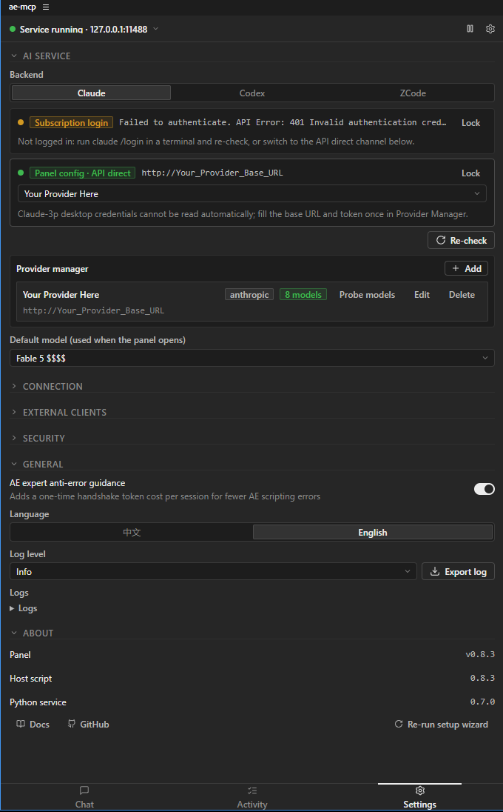
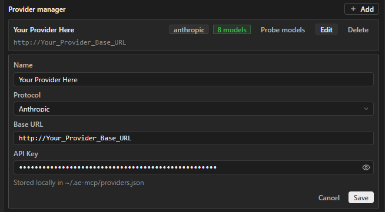
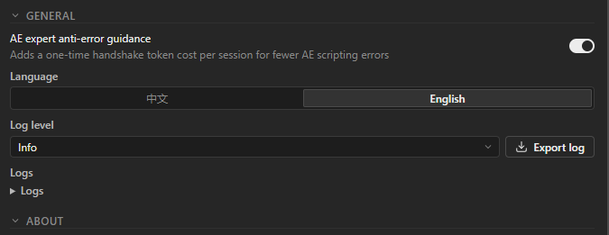
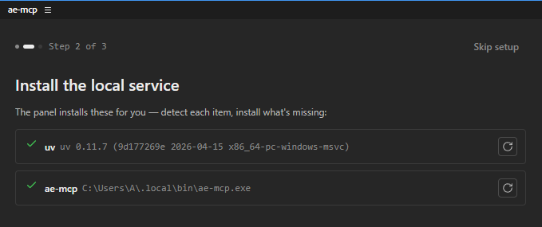
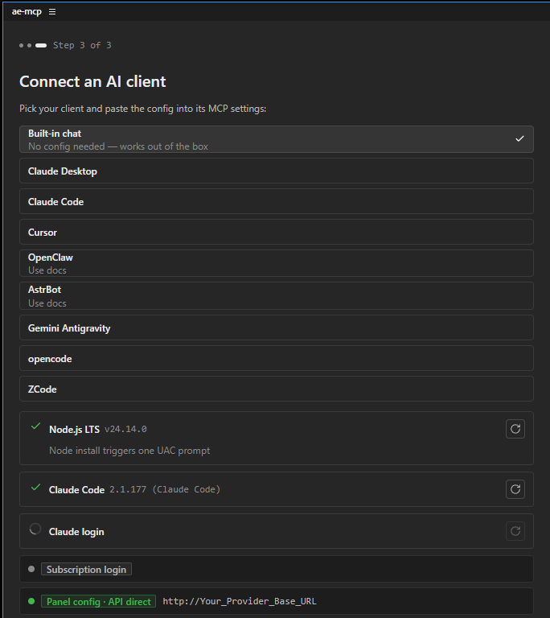
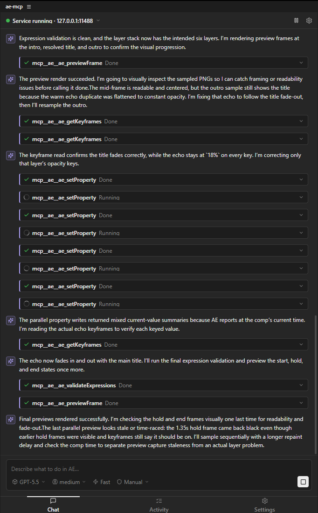
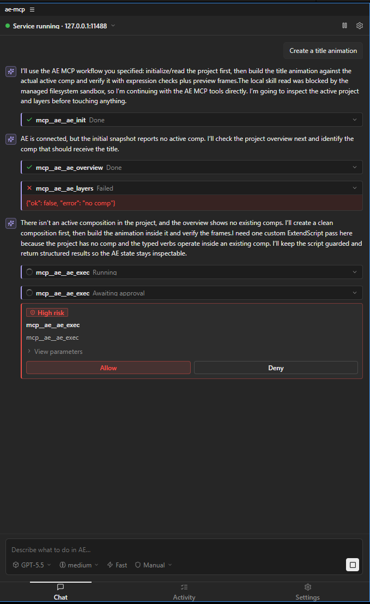
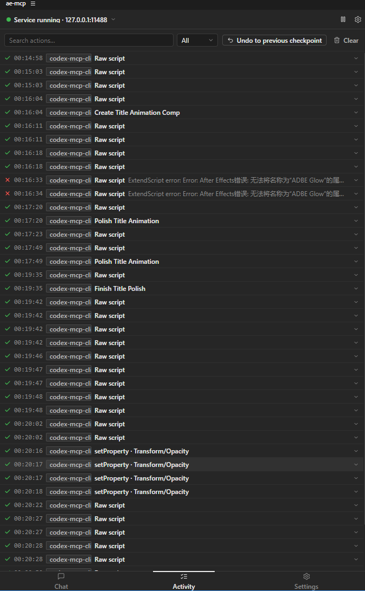

# ae-mcp

English | [简体中文](README.zh-CN.md)

ae-mcp is a backend-agnostic automation tool that keeps Adobe After Effects and AI agents in the same working context. Its MCP server exposes AE project state, tool execution, previews, screenshots, and checkpoints so an agent can understand and operate the current AE project during a conversation.

The MCP server is the core. Outside the MCP layer, ae-mcp also ships a CEP panel that wraps built-in agent chat, backend configuration, approval controls, diagnostics, and first-run setup. You can use ae-mcp from an external agent backend through MCP, or configure Claude / Codex / ZCode directly inside the AE panel.

**v0.9.3 is a Windows x64 release with two separately installed assets.** Install the signed ZXP for the CEP panel and manually copy the signed AEX into the selected After Effects plug-in directory. This release retains the existing external runtime/launcher requirement; it is not a zero-environment or ZXP-only installation.

## v0.9.3 Target Support Matrix

The published v0.9.3 assets target this release scope:

- Windows 11 24H2 (11.0.26100) or newer on x64. Windows on ARM is not supported.
- After Effects 2025 is the packaged acceptance host. The CEP manifest remains `[25.0,26.9]`; this release contains no macOS asset.

## Architecture

```text
Embedded panel chat or external MCP client
  -> packages/core (ae_mcp, Python stdio MCP server, 16 public tools)
  -> backend (packages/bridge, httpx)
  -> CEP panel Node host (plugin/host, Express, 127.0.0.1:11488)
     -> native RPC -> AEGP main-thread dispatcher
     -> CSInterface.evalScript -> ExtendScript (`ae_exec`)
  -> After Effects
```

`ae_previewFrame` remains the AE-internal `CompItem.saveFrameToPng` path for rendering real comp pixels, with viewer snapshot only as a fallback. `packages/snapshot-mss` provides Windows `ae_snapshot` screen capture through the `mss` backend.

The MCP core is backend-agnostic: external clients can talk to AE through the stdio server, while the CEP panel can also host built-in agent chat. The existing panel layer handles backend setup, approvals, diagnostics, and activity history. The v0.9.3 Windows release retains the existing external runtime/launcher setup and does not activate a bundled Windows RuntimeManager. Claude, Codex, and ZCode are built-in panel backends; OpenCode and other tools can still connect as external MCP clients.

## v0.9.3 Release Scope

- One final protected-`main` SHA produces the ZXP and AEX; changed source requires new artifacts and checksums.
- The AEX is distributed separately because a ZXP installer does not place nested files in After Effects' native plug-in directory.
- An integrated installer, automatic AEX deployment, Windows RuntimeManager, zero-environment onboarding, repair/rollback/uninstall lifecycle, macOS assets, and Windows ARM are outside this release.
- Both signatures use newly created self-signed identities and therefore do not establish a publicly trusted publisher.

## Install and First Run

Download the three named files from the v0.9.3 GitHub Release. Do not use source archives as substitutes for the signed assets:

| Role | Release asset |
|---|---|
| CEP panel | `ae-mcp-panel-v0.9.3-windows-x64.zxp` |
| Native AEGP plug-in | `AeMcpNative-v0.9.3-windows-x64.aex` |
| Integrity | `SHA256SUMS-v0.9.3.txt` |

Install the ZXP with a supported ZXP installer. With After Effects closed, copy the AEX to the selected host's `Support Files\Plug-ins\Extensions\AeMcpNative.aex` path using administrator permission, then restart After Effects and open `Window -> Extensions -> ae-mcp`. Keep the existing external runtime/launcher configured.

Verify both binaries with `SHA256SUMS-v0.9.3.txt`. See [Install](docs/INSTALL.md) and [Release](docs/RELEASE.md).

## Built-in Backends

| Backend | What it is for | Setup |
|---|---|---|
| Claude | Use Claude from the panel through subscription login or API direct mode. | Optional channel dependency: Claude Code CLI (`claude`) and its login. API direct mode instead needs an Anthropic API key or compatible provider. |
| Codex | Use Codex from the panel through CLI login, inherited config, or an OpenAI-compatible provider. | Optional channel dependency: Codex CLI and `codex login`; provider mode does not require that CLI. |
| ZCode | Use ZCode providers from the panel. | Optional channel dependency: the ZCode CLI/app-server supplied by a supported ZCode installation. API-key providers remain separate. |

Claude Code CLI is separate from Claude Desktop. Claude Desktop MCP configuration is not reused by the embedded Claude backend. Codex has the same distinction: the panel either talks to Codex CLI state or to providers configured for ae-mcp.

## Panel Features

- Built-in chat with Claude, Codex, and ZCode.
- Composer controls for model selection, reasoning effort, fast mode, and approval mode. Model switching is session-local and does not clear the conversation.
- Four approval modes: read-only, manual, auto, and bypass. Tool annotations drive consistent behavior across backends; destructive/external Tool Library plans remain interactive even in bypass mode.
- Unified Provider Manager with expandable editable records for OpenAI-compatible and Anthropic providers.
- Activity stream for agent operations.
- Local Tools library for generated JSX, expressions, prompt skills, recipes, and diagnostics. Index/search responses stay summary-only; full content appears only after Inspect.
- Kill switch to stop all AI operations immediately.
- Current diagnostics cover host status, access token, Python client signal, AE project state, ExtendScript ping, optional channel CLIs, and verified RuntimeManager state on macOS development builds.
- Log export for issue reports and debugging.
- AE expert guidance injection. This optional setting adds AE command and data-structure guidance to reduce scripting mistakes at the cost of extra prompt tokens.

## Screenshots

<table>
  <tr><td><br>Settings: backend channels and compact Provider Manager rows</td><td><br>Settings: expanded provider editor with local API key storage</td></tr>
  <tr><td><br>Settings: general options, language switch, logs, and About</td><td><br>Historical v0.9.0 development wizard: online `uv` and PATH launcher; not the v0.9.3 release path</td></tr>
  <tr><td><br>First-run wizard: built-in chat and external MCP client setup</td><td><br>Chat home: starter suggestions and composer controls</td></tr>
  <tr><td><br>Tool approval card for gated high-risk operations</td><td><br>Activity stream: agent operation history</td></tr>
</table>

## External MCP Clients

For Windows v0.9.3, an existing external launcher config has this shape after replacing `<USER>` with the actual account name:

```json
{
  "mcpServers": {
    "ae": {
      "command": "C:\\Users\\<USER>\\.ae-mcp\\bin\\ae-mcp.exe",
      "env": {
        "AE_MCP_BACKEND": "ae-mcp",
        "AE_MCP_PLUGIN_URL": "http://127.0.0.1:11488"
      }
    }
  }
}
```

Keep the expanded absolute path shown above; do not rely on a bare PATH command. The three Release assets do not install or activate that launcher. See [Install](docs/INSTALL.md).

External clients must run on the same machine as After Effects, or otherwise be able to reach `127.0.0.1:11488` on the AE machine. This matters for long-running or Dockerized IM-bot frameworks such as OpenClaw and AstrBot.

## Tool Surface

| Category | Public tools |
|---|---|
| Execution | `ae_exec`, `ae_nativeExec` |
| Visual / expression verification | `ae_previewFrame`, `ae_validateExpressions` |
| Undo / recovery | `ae_checkpoint`, `ae_revert`, `ae_snapshot` |
| Skill library | `ae_skillList`, `ae_skillUse` |
| Tool library | `ae_toolIndex`, `ae_toolSearch`, `ae_toolInspect`, `ae_toolUse` |
| Diagnostics | `ae_ping`, `ae_status`, `ae_diagnose` |

`ae_exec` is the default route for maintained ExtendScript semantics.
`ae_nativeExec` accepts only generated curated AEGP primitives. Load
`builtin:skill:ae-execution-guide` for routing, program composition, readback,
uncertain-write reconciliation, and real Undo verification.

Native programs contain at most 64 ordered operations. Values saved by resolver
operations are request-local; use stable locators to resolve again in a later
request. Writes require `operationKey` and `undoGroup`, then an independent
readback. Do not retry a possibly-side-effecting result before reconciling AE
state and audit evidence.

Inspect the generated primitive catalog in
`native/ae-plugin/protocol/native-primitives.json`, or load the default execution
guide through the Skill library. The four Tool Library calls follow progressive
disclosure: Index, Search, Inspect, then Use.
## Usage Notes

AI is not a finished-motion-design replacement. ae-mcp works best when you keep creative direction, taste, and final compositing judgment in human hands, while delegating repetitive operations, procedural animation, expression work, project cleanup, and refactoring of reusable AE structures.

For visual work, ask the agent to preview frames and verify intermediate results. For larger edits, create checkpoints so the project can return to a known good state.

## Development

Close every After Effects / AfterFX process before a development deployment. The CEP installer
preflights and stages the panel with its own backup flow. The native AEGP installer described
below independently verifies its artifact and returns a transaction ID for exact rollback.

### Native AEGP SDK input

The Adobe After Effects C/C++ Plug-in SDK is **not distributed with this repository** and
is never downloaded automatically. Developers must obtain the matching SDK from Adobe's
official [After Effects Developer page](https://developer.adobe.com/after-effects/) using
**Get the SDKs**, then extract it outside this checkout. The current native input lock is
After Effects SDK **25.6, build 61, 64-bit**:

| Platform | Expected outer archive | Bytes | SHA-256 |
|---|---|---:|---|
| macOS | `AfterEffectsSDK_25.6_61_mac.zip` | 2,039,255 | `c6abccd52ae25936b819b78c4fea2858bd161f216f72f75184fe9ec55a49756e` |
| Windows | `AfterEffectsSDK_25.6_61_win.zip` | 7,549,997 | `3d3a39175a09d07f6f9734284636f9eadce968b05161650e3cba097a95905330` |

Point `AE_SDK_ROOT` at the local extracted
`ae25.6_61.64bit.AfterEffectsSDK` directory (or its direct parent), and point
`AE_SDK_ARCHIVE` at the original outer archive. Before any native build, verify both the
archive identity and extracted layout/content:

```bash
export AE_SDK_ARCHIVE=/absolute/path/AfterEffectsSDK_25.6_61_mac.zip
export AE_SDK_ROOT=/absolute/path/ae25.6_61.64bit.AfterEffectsSDK
node scripts/package/ae-sdk-input.mjs verify-input --platform macos-arm64
```

Use `windows-x64` for the Windows input. The validator fails clearly with
`AE_SDK_ROOT_REQUIRED`/`AE_SDK_ARCHIVE_REQUIRED` when input is missing,
`AE_SDK_ARCHIVE_INVALID` for the wrong archive bytes, `AE_SDK_LAYOUT_INVALID` for a wrong
or changed extraction, and `AE_SDK_CONTENT_EVIDENCE_PENDING` when a platform does not yet
have a reviewed canonical content lock. Windows root content evidence is currently pending and
therefore fails closed.

Never commit the SDK archive, headers, examples, PDFs, PiPLtool, or package-bundled
extraction scripts/binaries to GitHub **or Git LFS**. Public CI contains only a guard that
rejects vendored SDK material; it never receives the SDK. Read the complete
[SDK intake, verification, and distribution policy](docs/native-sdk/SDK_INPUTS.md).

#### Build and install the native AEGP host on macOS

This development flow is separate from the CEP panel installer below. It currently builds only
an Apple Silicon arm64 AEGP host. Commit the product source first: evidence builds fail closed
with `AE_PLUGIN_SOURCE_DIRTY` unless the entire worktree is clean, so the receipt can identify
the native component source. To prevent bypassing the transactional installer, the
output path must be a new absolute directory under canonical `/private/tmp`; it must remain
outside every Git worktree, the Git common directory, and the SDK root.

```bash
BUILD_DIR=/private/tmp/ae-mcp-native-73
node native/ae-plugin/build-macos.mjs \
  --sdk-archive "$AE_SDK_ARCHIVE" \
  --sdk-root "$AE_SDK_ROOT" \
  --output "$BUILD_DIR"
node native/ae-plugin/verify-macos.mjs \
  --bundle "$BUILD_DIR/AeMcpNative.plugin"
```

The current native implementation checks the local user, After Effects process ancestry, endpoint,
and peer identity. These are compatibility-era implementation details, not a supported defense
against another local account or hostile same-user code. The product trust boundary is one trusted
user operating AE and selected clients on the same host; there is no connection code or fingerprint
ceremony. Do not add remote, multi-user, pairing, or hostile-local-process gates without a new
product decision. Provider/API secret confidentiality remains required; see
[the product trust policy](docs/THREAT_MODEL.md).

Close every After Effects, AfterFX, and aerender process before installing. The development
installer validates the receipt shape, product version, protocol metadata, platform, architecture,
entrypoint, signature, and installed copy, and installs the loadable bundle at
`~/Library/Application Support/Adobe/Common/Plug-ins/7.0/MediaCore/ae-mcp/AeMcpNative.plugin`:

```bash
node native/ae-plugin/install-dev-macos.mjs install \
  --artifact-dir "$BUILD_DIR"
```

The default `development` identity profile records source revisions but does not reject an
otherwise compatible locally built artifact only because its source commit or recorded payload
hashes differ. Product-version equality remains required because no compatibility range exists.
Use `--profile release-audit` for an explicit exact-source, exact-receipt, and exact-artifact audit;
release workflows select that profile themselves.

That MediaCore namespace is kept strict: it is either empty during a transaction or contains only
the active `AeMcpNative.plugin`. Transaction records and every complete stage, backup, failed, or
replaced bundle live outside Adobe's scan roots under
`~/Library/Application Support/AfterEffectsMCP/native-plugin-dev-v1/`. With AE closed, the installer
moves the complete legacy namespace into an off-scan quarantine, restores only the active bundle,
and resumes safely from interrupted migration boundaries. A `.disabled` suffix alone is not treated
as a safe isolation boundary. Recoverable metadata or staging remnants from an interrupted write are
preserved under the same state root's `orphan-evidence/`; if deployment evidence references an
incomplete record, recovery fails closed instead of guessing.

A persistent Darwin kernel guard serializes install, recovery, and rollback, including stale-owner
recovery. Do not run this installer concurrently from an older checkout: observed live legacy locks
are rejected, but cross-version installers do not share the new guard protocol.

Keep the returned `transactionId`. With AE closed, roll back exactly that current transaction:

```bash
TRANSACTION_ID="paste the transactionId from the install output here"
node native/ae-plugin/install-dev-macos.mjs rollback \
  --transaction "$TRANSACTION_ID"
```

If a previous installer process was interrupted between transaction phases, keep AE closed and
reconcile its durable record before retrying:

```bash
node native/ae-plugin/install-dev-macos.mjs recover
```

Ad-hoc signing and a successful local build are development evidence only. The generated receipt
deliberately keeps `distributionApproved`, `runtimeEvidence`, and `compatibilityEvidence` false;
each candidate still requires a recorded component-set real-AE gate through the public MCP surface.

The public AE execution surface has two routes. Use `ae_exec` for maintained
After Effects scripting-object-model operations. Use `ae_nativeExec` only for
curated AEGP primitives that require exact native graph, time, ratio, or
property semantics. Load `builtin:skill:ae-execution-guide` before composing a
non-trivial request.

A native request is one bounded linear `operations` array. Resolver operations
create typed request-local handles; later operations refer to them with
`{"ref":"name"}`. Handles never serialize and never survive a request, so
every later request resolves fresh handles from stable locators. Read programs
omit `operationKey` and `undoGroup`. A program containing a write requires both,
runs inside one real AE Undo group, and is not advertised as atomic.

Verify every write with an independent read. A possibly-side-effecting result
must be reconciled against AE state and audit evidence before any retry. Undo
availability is not Undo verification: execute real Undo and run another
independent read to prove restoration.

The generated primitive reference is bundled into the execution guide. The sole
hand-maintained catalog is
`native/ae-plugin/protocol/native-primitives.json`; validate generated projections
with `uv run python scripts/generate_native_exec.py --check`.

CEP panel macOS development setup:

```bash
uv sync --all-packages --group dev
(cd plugin/host && npm ci)
(cd plugin/sidecar && npm ci)
(cd plugin/panel && npm ci && npm run build)
./scripts/install-plugin-dev-macos.sh
```

Windows development setup:

```powershell
uv sync --all-packages --group dev
cd plugin\host
npm ci
cd ..\sidecar
npm ci
cd ..\panel
npm ci
npm run build
cd ..\..
.\scripts\install-plugin-dev.ps1
```

## Test

Non-live:

```powershell
uv run pytest
```

Live, with AE open and the ae-mcp panel running:

```powershell
$env:AE_MCP_LIVE_TESTS = "1"
$env:AE_MCP_BACKEND = "ae-mcp"
$env:AE_MCP_PLUGIN_URL = "http://127.0.0.1:11488"
uv run pytest packages/core/tests/live -o addopts='' -vv
```

Model-matrix smoke for Claude sidecar + Codex app-server:

```powershell
node scripts/live-model-matrix.mjs
```

## Package and Release

Maintainers merge release metadata first, then build the v0.9.3 Windows ZXP and AEX from the final clean protected-`main` commit. They sign and verify both assets, generate `SHA256SUMS-v0.9.3.txt`, run the After Effects 2025 public-path smoke, and upload those exact bytes without rebuilding. See [docs/RELEASE.md](docs/RELEASE.md).

## Implementation Notes

Third-party components:

- `plugin/client/CSInterface.js` is Adobe CEP `CSInterface` v11 and retains Adobe's original license notice in that file.
- `ae-mcp-snapshot-mss` uses `mss` and Pillow for screen capture.
- The Python bridge uses `httpx`; the CEP host uses Express; the panel UI uses React; the Claude sidecar uses the Claude Agent SDK.

## License

ae-mcp project code is MIT licensed. See [LICENSE](LICENSE).

Files carrying their own upstream license notices, such as Adobe `CSInterface.js`, are governed by those notices.
