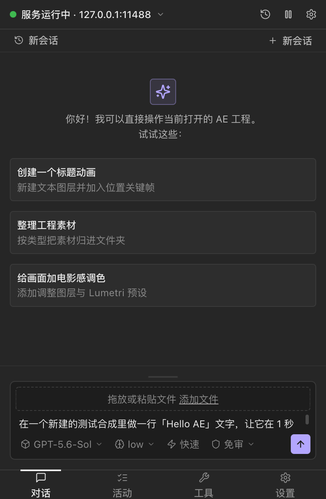
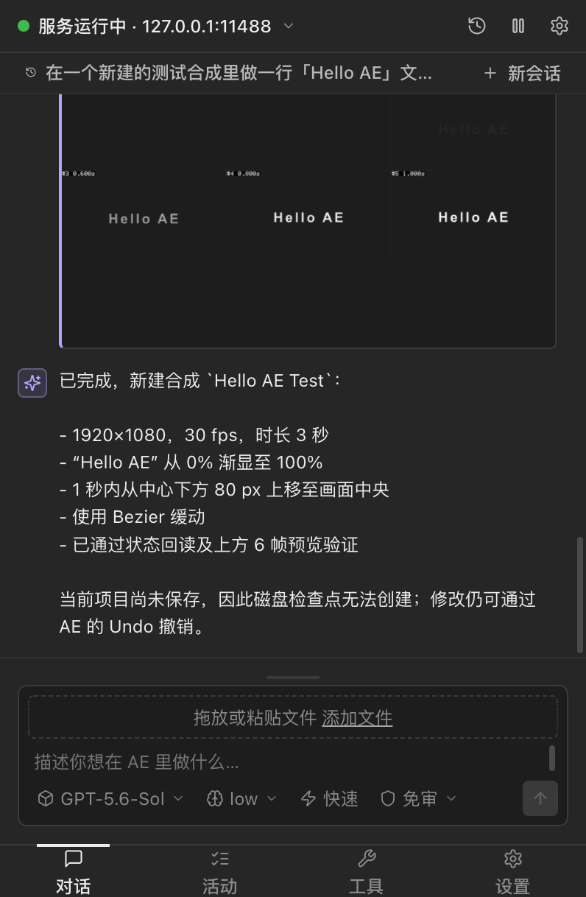
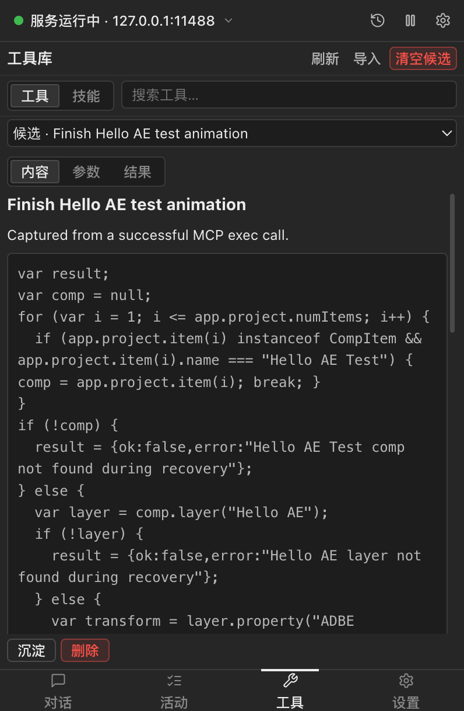

# ae-mcp

English | [简体中文](README.zh-CN.md)

**Let AI read your After Effects project, build animations, inspect the results, and save successful operations as reusable tools.**

ae-mcp is an open-source CEP extension that connects a running After Effects
project to the Model Context Protocol (MCP). Chat with Claude, Codex, or OpenCode
inside the panel, or connect an external MCP client to work with compositions,
layers, keyframes, and expressions.

[Download v0.11.0](https://github.com/JUNKDOGE-JOE/after-effects-mcp/releases/tag/v0.11.0)
· [Install](docs/INSTALL.md) · [Tool reference](docs/REFERENCE.md) · [Changelog](CHANGELOG.md)

## What it does

- **Read real project state:** inspect projects, compositions, layers, properties, and keyframes with pagination, sorting, and filtering.
- **Build and edit animations:** run ExtendScript for general AE operations; use native AEGP tools for exact time and object locators.
- **Inspect composition pixels:** export PNG frames from AE, sample multiple times in a grid, and compare A/B pixel differences.
- **Recover failed operations:** use checkpoints of saved projects, captured failure scripts, and a `recoveryId` to inspect, correct, or restore state.
- **Keep reusable tools:** successful scripts become replayable candidates that can be saved, pinned, archived, exported, and imported; prompt skills are supported too.
- **Follow execution:** use the panel's approvals, activity timeline, conversation history, and diagnostic export.

The workflow is read → execute → preview → correct → save for reuse. The AI
reads current state through the AE host, including unsaved changes, and checks
results using both project structure and composition previews.

## A complete workflow

Try a task like this in a test project:

```text
Create a new composition with the text Hello AE. Over one second, fade it in
and move it upward into the center. Read back the keyframes, then check the
animation with a multi-frame preview.
```

The screenshots show task entry, a six-frame preview, and the successful script
captured in the Tool Library. These are **actual v0.10.7 screens** illustrating
the workflow; v0.11.0 additions are described below.

<table>
  <tr><th>Describe the task</th><th>Inspect the result</th><th>Keep a reusable tool</th></tr>
  <tr>
    <td><a href="docs/assets/readme/chat-input.png"></a></td>
    <td><a href="docs/assets/readme/preview-result.png"></a></td>
    <td><a href="docs/assets/readme/tool-library.png"></a></td>
  </tr>
</table>

## What's new in v0.11.0

- **Multiple instances and parallel previews:** external clients can discover, launch, and route to multiple AE instances. Different projects can run concurrently; each project has one active writer, while read-only workers inspect and preview fixed checkpoint snapshots.
- **Session handoff:** after a panel turn or external AE call finishes, another eligible session can take over the idle project. In-flight calls, engine draining, and uncertain writes continue to block handoff.
- **AI working directory:** new chats default to the current AEP's folder, falling back to the user home folder if the project is unsaved or the directory is not writable. Choose a folder or restore the default in Settings; existing chats retain their directory.
- **Undo and recovery fixes:** fixes for mismatched Undo groups and checkpoint recovery contexts. Rendering must run separately, outside an Undo group.
- **Native and worker reliability:** improved cold-start native diagnosis, connection timeout recovery, and Windows background worker startup and shutdown cleanup.
- **16 public tools, up from 13:** adds `ae_instances`, `ae_workspace`, and `ae_readJob`, with the matching `ae-mcp-jkdg@0.11.0` stdio connector.

The release provides the Windows ZXP, Windows x64 native plug-in, and checksums.
The macOS arm64 native release asset is not yet available; final Mac package
installation and worker acceptance remain incomplete. See the
[v0.11.0 release notes](https://github.com/JUNKDOGE-JOE/after-effects-mcp/releases/tag/v0.11.0)
for verification scope and known limitations.

<a href="https://glama.ai/mcp/servers/@JUNKDOGE-JOE/after-effects-mcp">
  
</a>

<details>
<summary>Automatic setup: paste this prompt into the MCP client you want to use</summary>

```text
Install and configure ae-mcp for the current client receiving and executing
this prompt. Do not default to Claude Code or configure another client.
Before changing anything, inspect the local ae-mcp extension and native plug-in
files and versions, plus this client's existing MCP registration and actual
connection, read-only. Existence alone does not prove readiness. Compare with
the latest official stable release assets available for my platform:
- Client registration already correct: keep it; install only missing or damaged files.
- Files complete and versions suitable: only add or repair client registration.
- Both ready and current: verify without reinstalling.
- Newer version available: upgrade existing components, preserving user settings
  and other MCP configuration; do not downgrade. If versions cannot be established
  or platform assets are unavailable, explain rather than blindly overwrite.
Use the release ZXP and platform-native plug-in for needed file installation or
upgrade, then open Window > Extensions > ae-mcp in After Effects.
Identify this client's configuration method and location, preserving all other
MCP entries. Use http://127.0.0.1:11488/mcp if it supports Streamable HTTP;
for stdio only, configure `npx -y ae-mcp-jkdg` using this client's format.
If automatic editing is unavailable, give precise manual steps for this client.
Ask which client only if the target truly cannot be identified; never silently
fall back to Claude Code. Keep the AE panel open, refresh/reconnect or start a
new session as this client requires, then call ae_status to verify. If user
action is required first, state that verification is still pending.
```

</details>

## Install and first run

1. Download and install `ae-mcp-panel-v0.11.0.zxp` from the
   [v0.11.0 release](https://github.com/JUNKDOGE-JOE/after-effects-mcp/releases/tag/v0.11.0).
2. For `ae_nativeExec`, install `AeMcpNative-v0.11.0-windows-x64.aex` from the
   same release in the target AE plug-in directory. The native plug-in ships
   separately from the ZXP; see [Install](docs/INSTALL.md) for destinations.
   The roughly 60 MB ZXP includes the Windows OpenCode runtime. macOS uses
   OpenCode from PATH; check the release page for the later Mac native asset
   and its installation verification.
3. Start After Effects and open **Window > Extensions > ae-mcp**. Keep the panel
   open while an external client uses MCP.
4. Configure Claude, Codex, or OpenCode in panel Settings, or connect an
   external client as described below.

The panel itself is the MCP service. No separate repository server is needed.
External clients must run on the same machine as After Effects because the
default endpoint is loopback.

## Client connections

For one running panel, clients supporting Streamable HTTP can connect to the
URL shown in the panel. For example, Claude Code with the default address:

```bash
claude mcp add --transport http ae http://127.0.0.1:11488/mcp
```

For instance discovery and launch, or a stdio client such as Claude Desktop,
use the matching connector (requires Node.js 18 or later):

```json
{
  "mcpServers": {
    "ae": {
      "command": "npx",
      "args": ["-y", "ae-mcp-jkdg@0.11.0"]
    }
  }
}
```

Without an explicit URL, the connector discovers the installed extension's
multi-instance entry. It does not install or update the extension. Discover
or explicitly start an instance with `ae_instances`, bind the project with
`ae_workspace`, and pass the returned `context_id` on subsequent AE calls.
Setting `--url` or `AE_MCP_HTTP_URL` pins forwarding to one endpoint. Closing
the panel is an intentional disconnect and does not automatically reopen AE.

Alternatively, run the dependency-free stdio shim shipped in the installed
extension. This example pins one endpoint. Set `command` to system Node and
point `args` at the extension directory's `host/stdio-shim.js`:

```json
{
  "mcpServers": {
    "ae": {
      "command": "node",
      "args": ["<installed-extension>/host/stdio-shim.js"],
      "env": {
        "AE_MCP_HTTP_URL": "http://127.0.0.1:11488/mcp"
      }
    }
  }
}
```

Refresh or reconnect the client after setup, then call `ae_status` to verify.

## How it works

The MCP service runs directly in the CEP panel's Node host, at
`http://127.0.0.1:11488/mcp` by default. Additional instances register their
own endpoints.

```text
Panel Claude / Codex / OpenCode       External MCP client
                 |                   | HTTP or stdio connector
                 +---------+---------+
                    CEP Node MCP host
          Approvals · Project contexts · Tool Library · Logs
                     +-- ExtendScript → AE project reads/writes
                     +-- AEGP → Exact time and object locators
                     +-- Checkpoint → Read-only workers → Reads/PNG previews
```

ExtendScript handles general operations. The native AEGP plane retains 23
fixed primitives for exact rational time and generation-bound object locators.
Multiple instances do not permit simultaneous writers to the same project;
worker results always describe their specified checkpoint snapshot. See
[Architecture](docs/ARCHITECTURE_DIRECTION.md) for details.

## Panel capabilities

The CEP host advertises 16 public MCP tools:

| Area | Tools |
| --- | --- |
| Status | `ae_status` |
| ExtendScript and recovery | `ae_exec`, `ae_execRecover` |
| Read and visual verification | `ae_read`, `ae_previewFrame`, `ae_validateExpressions` |
| Project checkpoints | `ae_checkpoint`, `ae_revert` |
| Frozen native AEGP | `ae_nativeExec` |
| Tool Library and skills | `ae_toolSearch`, `ae_toolUse`, `ae_toolSave`, `ae_skillUse` |
| Instances, project contexts, and read jobs | `ae_instances`, `ae_workspace`, `ae_readJob` |

Successful `ae_exec` and `ae_execRecover` scripts are captured as deduplicated,
rerunnable Tool Library candidates. `ae_toolSave` promotes or creates reusable
JSX and prompt-skill artifacts; the Tools page manages candidates and saved
artifacts, including import/export. Usage counters and funnel events show what
gets replayed or retained, while the placeholder guard points compacted
conversations back to exact candidates and stops repeated placeholder retries.

The panel also provides approval modes, activity history, diagnostics, log
export, and built-in Claude, Codex, and OpenCode channels. Persistent host state
defaults to `~/.ae-mcp`; developers and tests can relocate it with
`AE_MCP_STATE_DIR`.

The public MCP tools are served by the CEP host. Writes should be followed by
an independent readback; potentially side-effecting failures must be
reconciled before retry, and Undo must be executed and verified separately.
A timeout cannot guarantee immediate interruption of synchronous ExtendScript;
PNG previews may omit Guide layers. See [Reference](docs/REFERENCE.md) for
multi-frame and difference parameters, recovery rules, and snapshot jobs.

## Development

Install the two Node workspaces and build the panel:

```bash
(cd plugin/host && npm ci)
(cd plugin/panel && npm ci && npm run build)
```

For a local CEP deployment, use the platform-specific script after the host
and panel are built:

```powershell
.\scripts\install-plugin-dev.ps1
```

```bash
./scripts/install-plugin-dev-macos.sh
```

The Adobe After Effects C/C++ Plug-in SDK is a developer-supplied input and
must remain outside this repository. Verify it before building the native
plug-in:

```bash
node scripts/package/ae-sdk-input.mjs verify-input --platform macos-arm64
```

For the frozen native plane, build into a new directory outside the repository.
The installer keeps transaction state under `native-plugin-dev-v1`; retain the
returned transaction ID if you install the result:

```bash
AE_SDK_ARCHIVE=/absolute/path/AfterEffectsSDK.zip
AE_SDK_ROOT=/absolute/path/AfterEffectsSDK
BUILD_DIR=/private/tmp/ae-mcp-native-dev
TRANSACTION_ID="paste-the-transaction-id-here"
node native/ae-plugin/build-macos.mjs \
  --sdk-archive "$AE_SDK_ARCHIVE" \
  --sdk-root "$AE_SDK_ROOT" \
  --output "$BUILD_DIR"
# The install state root is native-plugin-dev-v1.
node native/ae-plugin/install-dev-macos.mjs install --artifact-dir "$BUILD_DIR"
node native/ae-plugin/install-dev-macos.mjs rollback \
  --transaction "$TRANSACTION_ID"
```

The native plane is frozen; generated AEGP protocol files are checked in and
the capability-package code-generation pipeline is not part of normal
development.

## Tests and packaging

Run focused Node contracts locally:

```powershell
node --test scripts/package/test/verify-windows-zxp-stage.test.mjs
node --test scripts/package/test/zxp-payload-audit.test.mjs
```

The Windows ZXP staging command copies the panel, host, JSX, shared modules,
icons, generated host assets, and the pinned OpenCode runtime staged by
`node scripts/package/fetch-opencode-runtime.mjs`. It verifies the host's
exact Express `4.22.2` dependency and signs the ZXP once:

```powershell
.\scripts\package-zxp.ps1 -SkipSigning
```

The signed ZXP must contain no nested native binary; the bundled
`opencode.exe` is the one explicitly allowed executable. The packaging script
fails above 80 MB, and a release with the runtime is roughly 60 MB.

See [Install](docs/INSTALL.md), [Reference](docs/REFERENCE.md),
[Tool Library](docs/TOOL_LIBRARY.md), [Architecture](docs/ARCHITECTURE_DIRECTION.md),
[Workflow](docs/WORKFLOW.md), and [Release](docs/RELEASE.md) for maintained
operational and developer details.

## Sponsors

Thank you to everyone who supports the development and maintenance of ae-mcp!

Sponsorship is voluntary, and any amount is appreciated. Your support helps
with the project's development and maintenance.

**[Support via PayPal](https://paypal.me/junkdoge)**

<details open>
<summary>Scan to support via WeChat Pay or Alipay</summary>

<p>Scan with the corresponding app.</p>
<table>
  <tr><th>WeChat Pay</th><th>Alipay</th></tr>
  <tr>
    <td><a href="docs/assets/sponsorship/wechat-pay.jpg"></a></td>
    <td><a href="docs/assets/sponsorship/alipay.jpg"></a></td>
  </tr>
</table>

</details>

### Sponsor acknowledgements

| Sponsor | About | Contribution | Note |
| --- | --- | --- | --- |
| [**biheye-g**](https://github.com/biheye-g) | Bilibili content creator **匕禾页** | CNY 18 | First sponsor |
| \*青 | Alipay sponsor | CNY 30 | — |

## License

ae-mcp is released under the MIT License; see [LICENSE](LICENSE). Adobe's
`CSInterface.js` retains its upstream license notice.
