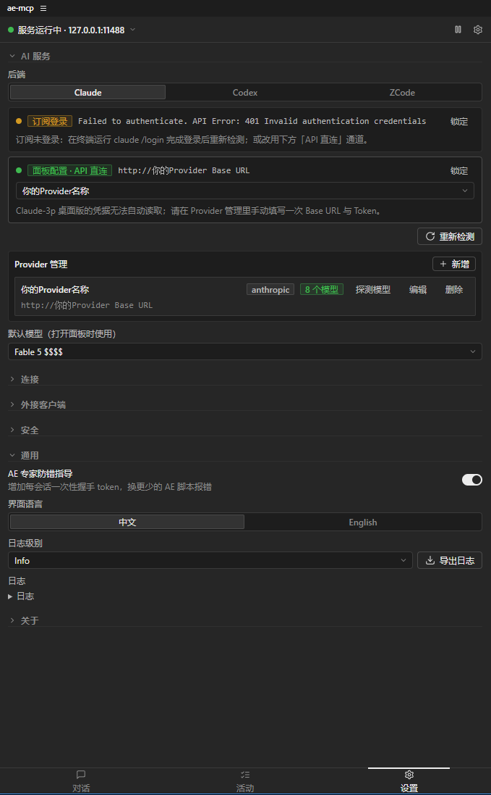
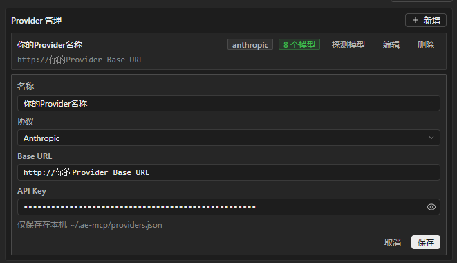
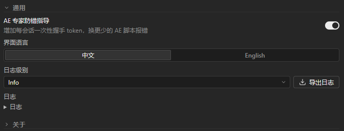
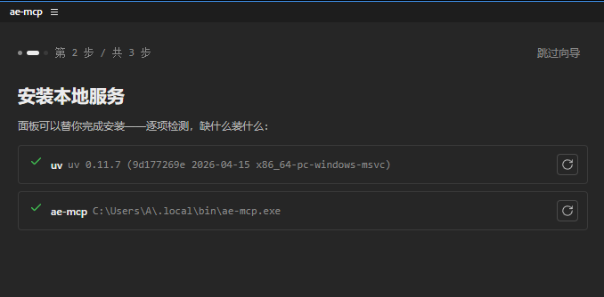
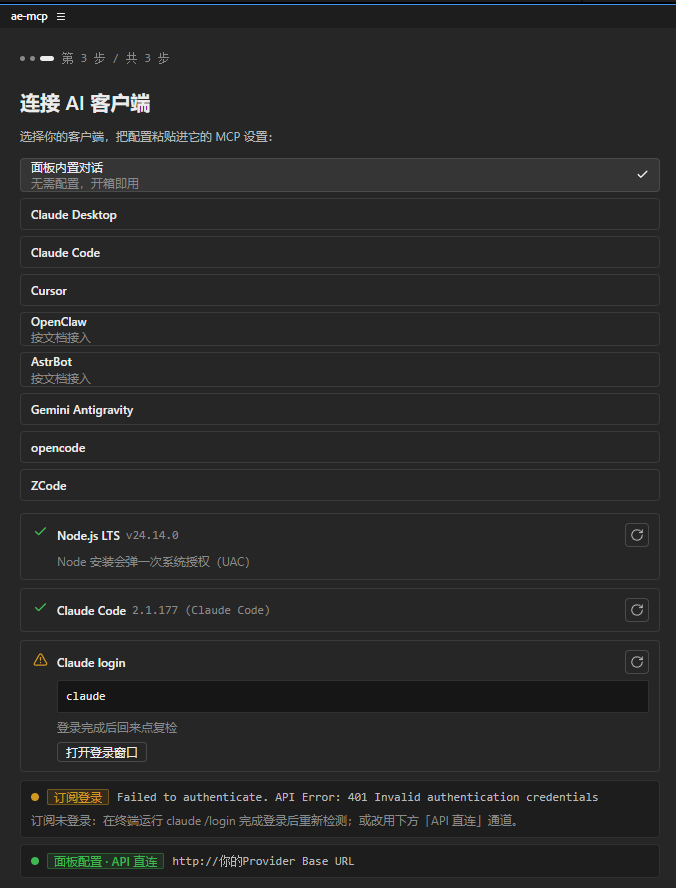
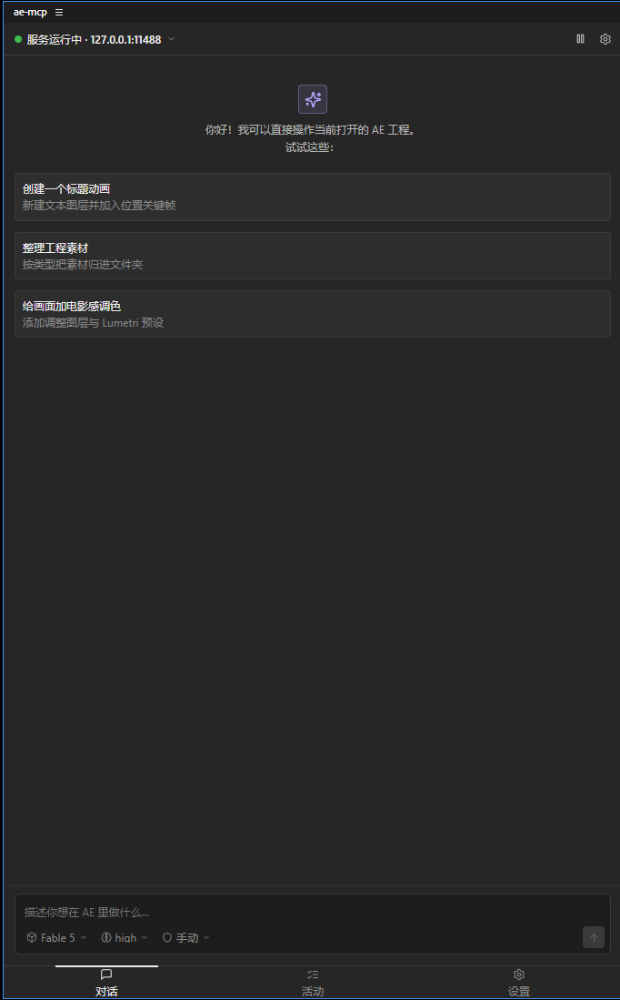
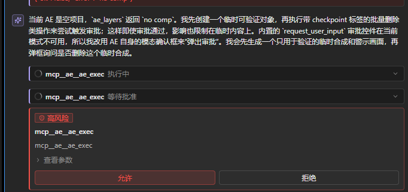
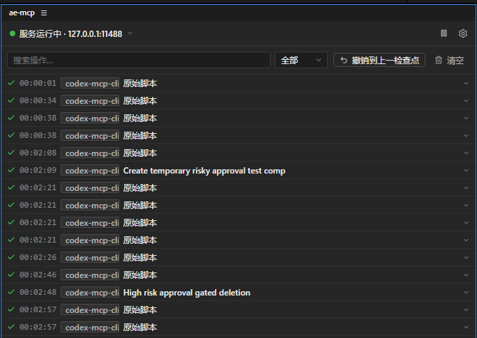

# ae-mcp

[English](README.md) | 简体中文

ae-mcp 是一个**后端无关**的 After Effects 自动化工具，用来让 AE 与 AI agent 保持同一个工作上下文。它通过 MCP server 暴露 AE 工程状态、工具调用、预览、截图和检查点，让 agent 能在对话中理解并操作当前 AE 项目。

MCP server 是核心。在 MCP 本体之外，ae-mcp 还包装了一套 CEP 面板插件，提供面板内对话、后端配置、审批、诊断和首跑安装。你可以根据自己的工作流选择：在外部 agent 后端里通过 MCP 使用 ae-mcp，或者直接在 AE 面板内配置 Claude / Codex / ZCode 后端进行对话。

**v0.9.2 是 Windows x64 正式版本。** macOS 兼容、包内 RuntimeManager、正式跨平台签名链以及完整 AE 25/26 实机矩阵转入 v0.9.3。

## v0.9.2 目标支持矩阵

v0.9.2 已发布资产面向以下已验证范围：

- Windows 11 24H2（11.0.26100）或更新版本，运行于 x64；不支持 Windows ARM。
- After Effects 25.x 已完成实机验证。CEP manifest 仍为 `[25.0,26.9]`；完整 AE 26 与 macOS 验收延后至 v0.9.3。

## 架构

```text
面板内对话或外部 MCP 客户端
  -> packages/core (ae_mcp, Python stdio MCP server, 51 个 ae_ 工具)
  -> backend (packages/bridge, httpx)
  -> CEP panel Node host (plugin/host, Express, 127.0.0.1:11488)
     -> native RPC -> AEGP 主线程 dispatcher
     -> CSInterface.evalScript -> ExtendScript（legacy JSX 工具）
  -> After Effects
```

`ae_previewFrame` 通过 `CompItem.saveFrameToPng` 渲染真实合成像素，viewer snapshot 只作为 fallback。`packages/snapshot-mss` 提供跨平台 `mss` 截图后端，用于 `ae_snapshot` 屏幕捕获。

MCP core 本身保持后端无关：外部客户端可以通过 stdio server 与 AE 对话，CEP 面板也可以在 AE 内承载内嵌 agent 对话。现有面板层负责后端配置、审批、诊断和活动历史。v0.9.2 最终契约还要求首跑包内 runtime 校验，但 RuntimeManager 行为仍受门禁，本文不声称它已经交付。Claude、Codex、ZCode 是面板内置后端；OpenCode 和其他工具仍可以作为外部 MCP 客户端接入。

## v0.9.2 候选范围

- protected `main` 上的同一个候选 SHA 同时生成两个平台原生载荷；候选失败或发生任何变化，都必须以新 SHA 重新构建。
- 核心能力按离线、自包含发布包设计。系统 Python、系统 Node、`uv`、PyPI 和 npm 解析只属于开发环境，不是普通用户安装前提。
- Provider、Tool Library 与 Platform Helper 已完成实现，并通过 Windows AE 2025 实机验证。v0.9.2 发布使用有效至 2037 年证书的自签名 Windows ZXP；本次资产没有 TSA 时间戳，其中原生 Helper 二进制也尚未做 Authenticode。包内 RuntimeManager、正式原生签名、macOS 和其余实机矩阵转入 v0.9.3。
- UXP、Intel Mac、Windows ARM、provider 配置导出以及 ZCode 桌面 captcha/runtime-header 桥接不属于 v0.9.2 支持范围。

## 安装和首次启动

普通用户只安装 v0.9.2 发布组中的一个不可变平台资产。不要用源码归档或在线 `uv`/PyPI 安装替代签名发布资产：

| 平台 | 安装资产 | 可审计载荷 |
|---|---|---|
| Windows 11 24H2+ x64 | `ae-mcp-panel-v0.9.2-windows-x64.zxp` | 同一个 ZXP |

使用受支持的 ZXP installer 安装 `ae-mcp-panel-v0.9.2-windows-x64.zxp`，重启 After Effects，再打开 `Window -> Extensions -> ae-mcp`。本版继续使用现有外部 runtime 配置；包内离线 RuntimeManager 延后至 v0.9.3。

GitHub Release 会发布精确的 Windows 资产及其 SHA-256。详见[安装文档](docs/INSTALL.md)和[发布文档](docs/RELEASE.md)。

## 选择并登录后端

ae-mcp 是后端无关的。面板内对话支持三类内嵌后端，按你的账号和工作流选择即可。

| 后端 | 适合场景 | 登录 / 配置方式 |
|---|---|---|
| Claude | 通过 Claude 订阅或 API 直连在面板内运行 agent。 | 可选通道依赖：Claude Code CLI（`claude`）及其登录态；API 直连改用 Anthropic API key 或兼容 provider。 |
| Codex | 通过 Codex CLI、Codex 配置继承，或 OpenAI-compatible provider 在面板内运行 agent。 | 可选通道依赖：Codex CLI 与 `codex login`；provider 模式不依赖该 CLI。 |
| ZCode | 在面板内使用 ZCode provider。 | 可选通道依赖：受支持 ZCode 安装提供的 ZCode CLI/app-server；API-key provider 与它分离。 |

这里的 Claude Code 指 Claude Code CLI，不是 Claude Desktop。Claude Desktop 里配置的 MCP 插件不会被内嵌 Claude 后端读取。Codex 也类似：面板读取的是 Codex CLI 状态，或者 ae-mcp 自己的 Provider 管理器配置。

## 主面板

面板最常用的是内嵌对话。你可以直接输入提示词，让 agent 检查工程、创建图层、改属性、写表达式、预览画面或执行更复杂的 AE 自动化任务。

Composer 快捷控制包含：

- 模型选择，带成本标识；会话内切换模型不会清空对话。
- 思考深度，对应后端原生 effort / reasoning 档位。
- 快速模式，用更高 token 消耗换更快响应，具体成本取决于后端厂商定价。
- 审批模式，用于控制工具调用放行策略。

Tools 标签页管理本地生成的 JSX、表达式、提示词 skill、recipe 和诊断制品。Index/Search 只展示摘要，Inspect 后才读取完整内容；这里没有云同步。

### 审批四档

审批语义由工具 annotations 驱动，跨后端保持一致。

| 模式 | 行为 |
|---|---|
| 只读 | 只放行读取类操作。 |
| 手动 | 读取自动放行；write、destructive、external 操作需要确认。 |
| 自动 | 常规操作自动放行，高风险操作仍会拦下确认。 |
| 免审 | 普通工具按既有免审策略放行；Tool Library 的 destructive/external 计划仍必须逐次确认。 |

## 活动流与安全

- 活动流会记录 agent 执行过的操作，方便回看发生了什么。
- Kill switch 可以一键熔断所有 AI 操作，发现方向不对时可以立刻停手。
- 撤销仍走 AE 自己的 Undo 体系。插件会尽量把操作封装进 undo group，通常可以直接在 AE 里 `Ctrl+Z`。
- 对风险较高的大改，建议使用 `ae_checkpoint` 或在 `ae_exec` 中传入 `checkpoint_label`，后续可通过 `ae_revert` 回到检查点。检查点功能需要 AE 工程先保存到磁盘。
- 当前诊断页检查 host、访问 token、Python 客户端信号、AE project、ExtendScript ping 与可选通道 CLI；已安装 runtime 诊断属于受门禁的 RuntimeManager 契约。
- 日志导出可以把面板日志、host 信息和 sidecar tail 汇总出来，方便提交 issue 时定位问题。

## 设置项

设置页主要包含：

- 后端凭证通道：Claude / Codex / ZCode 各自的登录状态、API key、provider 和通道优先级。
- Provider 管理器：新增、编辑、删除 OpenAI-compatible 与 Anthropic provider，并通过 `/v1/models` 探测模型列表；可改项支持展开和收起。
- MCP 配置生成：为 Claude Desktop、Claude Code、Cursor、OpenCode、OpenClaw、AstrBot、Gemini Antigravity、ZCode 等外部客户端生成配置。
- 访问 token：面板与 agent 后端之间的握手密钥，普通用户通常不用手动修改。
- 连接来源管理：查看尝试连接面板的后端名称，必要时屏蔽预期外来源，避免串线。
- AE 专家防错指导：在会话开始时向 agent 注入 AE 命令和数据结构提示，以减少脚本错误。它会占用额外输入 token，可按需关闭。

## 截图

<table>
  <tr><td><br>设置页：后端通道与收起状态的 Provider 管理器</td><td><br>设置页：展开编辑 provider，本地保存 API key</td></tr>
  <tr><td><br>设置页：通用选项、界面语言、日志与关于</td><td><br>历史 v0.9.0 开发向导：在线 `uv` 与 PATH launcher 安装；不能代表 v0.9.2 包内 runtime UX</td></tr>
  <tr><td><br>首跑向导：选择面板内对话或外部 MCP 客户端</td><td><br>聊天首页：启动建议与 composer 快捷选择条</td></tr>
  <tr><td><br>工具审批卡片：高风险操作确认</td><td><br>活动流：agent 操作历史</td></tr>
</table>

## 通过 MCP 接入外部客户端

面板内对话覆盖 Claude、Codex、ZCode 三类后端。如果你使用 Cursor、Claude Desktop、Claude Code、OpenCode、OpenClaw、AstrBot、Gemini Antigravity、ZCode 等外部客户端，可以通过面板生成的 MCP config 接入。

v0.9.2 最终 Panel 生成的最小配置形态如下：

```json
{
  "mcpServers": {
    "ae": {
      "command": "/Users/<USER>/.ae-mcp/bin/ae-mcp",
      "env": {
        "AE_MCP_BACKEND": "ae-mcp",
        "AE_MCP_PLUGIN_URL": "http://127.0.0.1:11488"
      }
    }
  }
}
```

这是最终稳定 launcher 契约。请把 `<USER>` 替换为实际 macOS 账户名；最终 Panel 生成器必须输出展开后的绝对路径。Windows 必须使用 `%USERPROFILE%\.ae-mcp\bin\ae-mcp.exe` 展开后的绝对路径。RuntimeManager 获批实施后必须把当前 Panel 生成器的裸 PATH `ae-mcp` 改为平台绝对路径；fail-closed 原生/产品验收 build guard 会在该差异存在时阻止发布 v0.9.2。

关键限制：ae-mcp 默认通过 `127.0.0.1:11488` 连到 AE 面板，所以外部客户端必须和 After Effects 在同一台机器上，或者能访问 AE 所在机器的这个端口。OpenClaw、AstrBot 这类常驻或 Docker 化的 IM-bot 框架尤其要注意。

## 工具能力

| 分类 | Tools |
|---|---|
| Project | `ae_init`, `ae_overview`, `ae_layers`, `ae_listProjectItems`, `ae_listCompositionLayers`, `ae_listSelectedLayers`, `ae_getCompositionTime`, `ae_listLayerProperties`, `ae_listLayerPropertyKeyframes`, `ae_setLayerPropertyValue`, `ae_readProps`, `ae_searchProject` |
| Mutation | `ae_exec`, `ae_applyEffect`, `ae_applyLayerEffect`, `ae_createLayer`, `ae_createComposition`, `ae_createCompositionLayer`, `ae_setProperty`, `ae_moveLayer`, `ae_selectLayers`, `ae_setTime` |
| Read-typed | `ae_getTime`, `ae_getProperties`, `ae_scanPropertyTree`, `ae_inspectPropertyCapabilities`, `ae_getExpressions`, `ae_validateExpressions`, `ae_getKeyframes` |
| Preview / capture | `ae_previewFrame`, `ae_snapshot` |
| Rigging | `ae_createRig` |
| Skill | `ae_skillList`, `ae_skillCreate`, `ae_skillEdit`, `ae_skillDelete`, `ae_skillUse` |
| Tools 工具库 | `ae_toolIndex`, `ae_toolSearch`, `ae_toolInspect`, `ae_toolUse`, `ae_toolCreate`, `ae_toolEdit`, `ae_toolDelete`, `ae_toolArchive`, `ae_toolDuplicate`, `ae_toolPromoteFromHistory`, `ae_toolImport`, `ae_toolExport` |
| Checkpoint | `ae_checkpoint`, `ae_revert` |
| Diagnostic | `ae_ping`, `ae_status`, `ae_diagnose` |

表达式工作流建议先跑 `ae_validateExpressions`，再做视觉检查。大改前建议使用 `ae_checkpoint` 或在 `ae_exec` 上传 `checkpoint_label`。

### 本地 Tools 工具库

原生制品保存在 `~/.ae-mcp/tools`。已有 `ae.skill*` 文件仍以原路径作为唯一规范副本，升级不会复制或分叉它们；用户与 bundled 的同名 skill 在 Tool Library 中保留不同 ID，`ae_skillUse` 继续按用户优先的既有顺序解析。成功生成的 JSX/表达式可以成为不可执行的 history candidate；导入的 `.aemcptools` 包在隔离区完成路径、链接、体积、哈希、schema 和秘密扫描后也只会进入 candidate。改变状态前应先 Inspect：history candidate 用 `ae_toolPromoteFromHistory`，imported candidate 用 `ae_toolEdit` 并传 `{"changes":{"status":"saved"}}`。

发现顺序是 `ae_toolIndex` → `ae_toolSearch` → `ae_toolInspect`。只渲染、不执行时使用 `ae_toolUse(action="render")`；execute/apply 操作使用 prepare → grant → execute 三阶段协议。计划绑定制品及依赖哈希、规范化参数、operation、target、risk 与过期时间；grant 短时有效且只能消费一次。session 放行只适用于 write 风险，并绑定 content hash、operation 和规范化 target，不能按工具名缓存。

每次有副作用的 start/execute 请求都应使用稳定的 `operation_id`，且只能在重试同一 `planHash` 时复用。共享同一 Tool Library 的多个 Core 会为这组标识返回同一个 queued/running/terminal execution，只有预约持有者会分发 backend；同一 operation ID 配另一个计划会返回 `tool_operation_conflict`。若持有者在分发后退出，恢复结果会是 `outcome-unknown` 与 `inspect-state`；使用新 operation ID 前必须先核对 AE 状态和审计证据。

## 使用建议

AI 目前还不能稳定替代动效师、合成师或设计师的最终判断。更可靠的使用方式是分工协作：

- 人来负责审美把控、画面方向、基础工程结构和最终合成判断。
- AI 更适合处理重复性操作、结构相似工程的批量处理、逻辑性强的程序化动画、表达式编写、工程整理，以及在画面不变的前提下重构工程结构。

做视觉任务时，建议让 agent 多用 `ae_previewFrame` 检查中间结果。做大范围修改前，建议先建检查点。

## 开发

开发部署前必须关闭全部 After Effects / AfterFX 进程。CEP 安装器按自己的备份流程预检并暂存面板；
下文的原生 AEGP 安装器会独立验证制品，并返回用于精确回滚的事务 ID。

### 原生 AEGP SDK 输入

Adobe After Effects C/C++ Plug-in SDK **不随本仓库分发**，项目也不会自动下载它。开发者必须前往 Adobe 官方
[After Effects Developer 页面](https://developer.adobe.com/after-effects/)，通过 **Get the SDKs** 自行取得匹配版本，并解压到仓库之外。当前原生输入固定为 After Effects SDK **25.6、build 61、64 位**：

| 平台 | 预期外层压缩包 | 字节数 | SHA-256 |
|---|---|---:|---|
| macOS | `AfterEffectsSDK_25.6_61_mac.zip` | 2,039,255 | `c6abccd52ae25936b819b78c4fea2858bd161f216f72f75184fe9ec55a49756e` |
| Windows | `AfterEffectsSDK_25.6_61_win.zip` | 7,549,997 | `3d3a39175a09d07f6f9734284636f9eadce968b05161650e3cba097a95905330` |

将 `AE_SDK_ROOT` 指向本地解压得到的 `ae25.6_61.64bit.AfterEffectsSDK` 目录（或它的直接父目录），并将
`AE_SDK_ARCHIVE` 指向原始外层压缩包。任何原生构建前都要同时校验压缩包身份和解压后的布局/内容：

```bash
export AE_SDK_ARCHIVE=/绝对路径/AfterEffectsSDK_25.6_61_mac.zip
export AE_SDK_ROOT=/绝对路径/ae25.6_61.64bit.AfterEffectsSDK
node scripts/package/ae-sdk-input.mjs verify-input --platform macos-arm64
```

Windows 输入使用 `windows-x64`。输入缺失时会明确返回
`AE_SDK_ROOT_REQUIRED`/`AE_SDK_ARCHIVE_REQUIRED`；压缩包字节不匹配返回
`AE_SDK_ARCHIVE_INVALID`；解压目录版本、布局或内容不匹配返回 `AE_SDK_LAYOUT_INVALID`；平台尚无已建立并复核的固定内容锁时返回
`AE_SDK_CONTENT_EVIDENCE_PENDING`。Windows 根目录内容证据目前仍待建立，因此会安全地拒绝构建。

不要把 SDK 压缩包、头文件、示例、PDF、PiPLtool 或包内附带的解包脚本/二进制提交到 GitHub，**也不要提交到 Git LFS**。公开 CI 只运行防误提交检查，从不接收 SDK。完整要求见
[SDK 引入、校验与分发策略](docs/native-sdk/SDK_INPUTS.md)。

#### 在 macOS 上构建并安装原生 AEGP host

这是原生 AEGP 的开发流程，与下方 CEP 面板安装器相互独立。目前只构建 Apple Silicon arm64
目标。请先提交产品源码：用于取证的构建要求整个工作树干净，否则会以
`AE_PLUGIN_SOURCE_DIRTY` 安全失败，从而确保回执能绑定到精确 commit。为防止绕过事务安装器，输出必须是
canonical `/private/tmp` 下尚不存在的绝对目录，并且位于所有 Git worktree、Git common directory 和 SDK
根目录之外。

```bash
BUILD_DIR=/private/tmp/ae-mcp-native-73
node native/ae-plugin/build-macos.mjs \
  --sdk-archive "$AE_SDK_ARCHIVE" \
  --sdk-root "$AE_SDK_ROOT" \
  --output "$BUILD_DIR"
node native/ae-plugin/verify-macos.mjs \
  --bundle "$BUILD_DIR/AeMcpNative.plugin"
```

安装前必须关闭所有 After Effects、AfterFX 和 aerender 进程。开发安装器会校验构建回执和安装后的副本，
最终安装位置为
`~/Library/Application Support/Adobe/Common/Plug-ins/7.0/MediaCore/ae-mcp/AeMcpNative.plugin`：

```bash
node native/ae-plugin/install-dev-macos.mjs install \
  --artifact-dir "$BUILD_DIR"
```

MediaCore 命名空间采用严格约束：事务进行中允许为空，其余时间只能包含当前生效的
`AeMcpNative.plugin`。事务记录以及完整的 stage、backup、failed、replaced bundle 全部保存在 Adobe
扫描根之外的 `~/Library/Application Support/AfterEffectsMCP/native-plugin-dev-v1/`。AE 关闭时，安装器会先把
完整的旧命名空间移入扫描区外的隔离区，再只恢复当前生效的 bundle；迁移在各个中断边界都可继续恢复。
仅添加 `.disabled` 后缀不再被视为可靠隔离。写入中断后可安全处理的元数据或暂存残留会保存在同一状态根的
`orphan-evidence/`；如果不完整记录已被部署证据引用，恢复会拒绝猜测并保持失败关闭。

安装、恢复、回滚以及过期 owner 的接管由一个持久的 Darwin 内核 guard 串行化。不要同时运行旧 checkout
中的安装器：安装器会拒绝已观察到的旧版存活锁，但跨版本安装器并不共享新的 guard 协议。

请保留输出中的 `transactionId`。关闭 AE 后，可精确回滚当前这笔事务：

```bash
TRANSACTION_ID="在这里粘贴安装输出中的 transactionId"
node native/ae-plugin/install-dev-macos.mjs rollback \
  --transaction "$TRANSACTION_ID"
```

如果安装器进程曾在事务阶段之间被中断，请保持 AE 关闭，并在重试前根据持久化记录恢复一致状态：

```bash
node native/ae-plugin/install-dev-macos.mjs recover
```

Ad-hoc 签名和本地构建成功只属于开发证据。生成的回执会刻意保持
`distributionApproved`、`runtimeEvidence` 和 `compatibilityEvidence` 为 false；每个候选提交仍必须通过
精确 commit 的真实 AE + 公开 MCP 门禁。当前开发态原生 surface 刻意保持很小：
`ae_projectSummary` 读取工程摘要，`ae_getProjectBitDepth` 读取当前 8/16/32 bits-per-channel，
`ae_setProjectBitDepth` 使用幂等键执行 SDK 明确标记为可撤销的修改，并做原生 readback 验证。
`ae_listProjectItems` 返回有界的工程项目分页；将其中的 composition locator 原样复制给
`ae_getCompositionTime`，可读取合成当前时间的有符号 `value`、正数 `scale` 与精确约分后的
`secondsRational`；也可复制给 `ae_listCompositionLayers`，读取对应合成的有界图层分页（默认
25、最大 50），或复制给 `ae_listSelectedLayers`，读取该精确合成中当前被选中的图层。选择结果
复用同一套稳定 layer locator，并按图层堆栈顺序确定性排列；property、mask、effect、keyframe
等非图层选择会被明确排除。原生通道
返回的 layer locator 可继续交给 `ae_listLayerProperties`，读取一页直接子属性（默认和最大均为
25）；仅当返回项的 `groupingType` 为 `named-group` 或 `indexed-group` 时，才可把其 property
locator 再传回并只向下进入一层 group。原始值绑定当前合成时间，
可安全表示的 primitive 使用明确的十进制字符串编码，复杂 SDK 值会标记为 unsupported，绝不
泄露原生 handle。将返回的 primitive leaf locator 交给 `ae_listLayerPropertyKeyframes`，可分页
读取原生关键帧（默认和最大均为 25）；每项包含一基索引、精确合成时间 `value/scale`、带类型的
primitive 值以及原生入/出插值，并且绝不回退 JSX。将返回的 layer locator 与 primitive leaf locator 交给
`ae_setLayerPropertyValue`，并提供稳定的幂等键，即可通过原生 `AEGP_SetStreamValue` 写入。
结果包含已验证的 before/after、审计 provenance 与 AE Undo 可用性；若写入后的响应不确定，
必须先检查 AE 状态再考虑重试。`ae_createComposition` 接受精确名称和稳定幂等键，通过
`AEGP_CreateComp` 直接创建根级合成；尺寸默认 1920x1080、时长默认 5/1 秒、帧率默认 24/1、
像素宽高比默认 1/1，也可全部用整数或精确有理数覆盖。结果返回新 composition locator、已验证
的设置与数量、原生 provenance 和 Undo 可用性，且不会回退 JSX。将新鲜的 composition locator 传给
`ae_createCompositionLayer`，可用精确名称与稳定幂等键创建一个原生 null 或 solid 图层；solid
的颜色、尺寸与时长可选，省略时使用契约声明的默认值。结果返回修改后的新 locator、数量证据、
原生 provenance 与 Undo 可用性；同一 intent 的 replay 不会重复创建。成功后旧图结构 generation
已失效，后续读取应使用结果中的新 composition locator。原生通道不可用时这些工具会明确失败，
不会回退到 JSX。将新鲜的 layer locator、已安装效果精确且不受语言影响的 matchName（例如
`ADBE Slider Control`）和稳定幂等键传给 `ae_applyLayerEffect`，AEGP 主线程 dispatcher 会调用
`AEGP_ApplyEffect`，并验证效果总数与同 matchName 数量都恰好增加 1。结果返回插入索引、效果
身份、新 layer locator、原生 provenance、审计证据和 Undo 可用性；相同 intent 的 replay 不会
重复添加。后续读取 Effects group 必须使用返回的新 locator；遇到
`POSSIBLY_SIDE_EFFECTING_FAILURE` 时，先核对 AE 状态与审计，禁止盲目重试。

CEP 面板 macOS 开发环境：

```bash
uv sync --all-packages --group dev
(cd plugin/host && npm ci)
(cd plugin/sidecar && npm ci)
(cd plugin/panel && npm ci && npm run build)
./scripts/install-plugin-dev-macos.sh
```

Windows 开发环境：

```powershell
uv sync --all-packages --group dev
cd plugin\host
npm ci
cd ..\sidecar
npm ci
cd ..\panel
npm ci
npm run build
cd ..\..
.\scripts\install-plugin-dev.ps1
```

## 测试

非 live 测试：

```powershell
uv run pytest
```

live 测试需要 AE 打开且 ae-mcp 面板运行：

```powershell
$env:AE_MCP_LIVE_TESTS = "1"
$env:AE_MCP_BACKEND = "ae-mcp"
$env:AE_MCP_PLUGIN_URL = "http://127.0.0.1:11488"
uv run pytest packages/core/tests/live -o addopts='' -vv
```

模型矩阵 smoke（Claude sidecar + Codex app-server）：

```powershell
node scripts/live-model-matrix.mjs
```

## 打包与发布

维护者只能通过受保护的 `build-rc.yml` 工作流生成 v0.9.2 资产。Mac arm64 与 Windows x64 的精确字节由 `artifact-manifest-v0.9.2.json` 绑定，通过 `macos-rc-attestation` 与 `windows-rc-attestation` 后，再由 `release.yml` 原样提升且不重新构建。签名凭据、再分发批准、AE 25/26 安装和 Windows x64 验证机都是外部前置条件；完整流程见 [docs/RELEASE.md](docs/RELEASE.md)。

## 实现说明

第三方组件：

- `plugin/client/CSInterface.js` 是 Adobe CEP `CSInterface` v11，文件内保留 Adobe 原始许可声明。
- `ae-mcp-snapshot-mss` 使用 `mss` 和 Pillow 做屏幕截图。
- Python bridge 使用 `httpx`；CEP host 使用 Express；面板 UI 使用 React；Claude sidecar 使用 Claude Agent SDK。

## 开源协议

ae-mcp 项目代码使用 MIT License，见 [LICENSE](LICENSE)。

带有上游许可声明的文件，例如 Adobe `CSInterface.js`，按其文件内许可声明执行。
