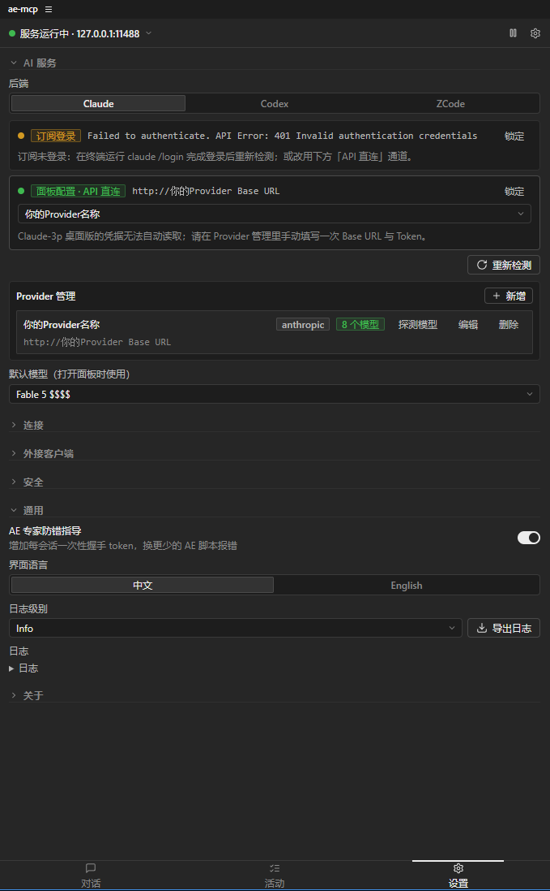
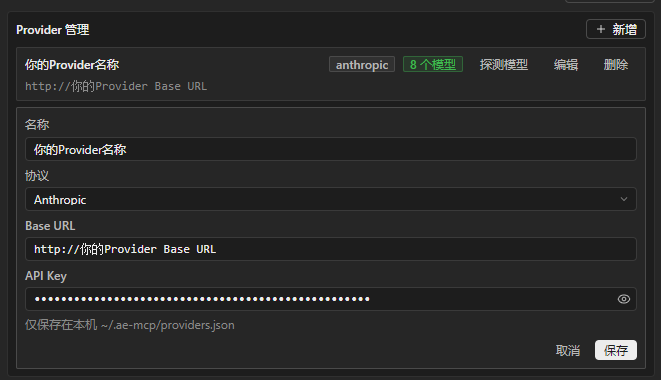
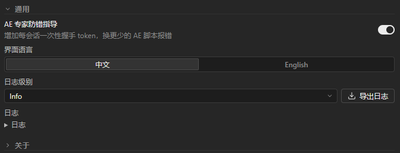
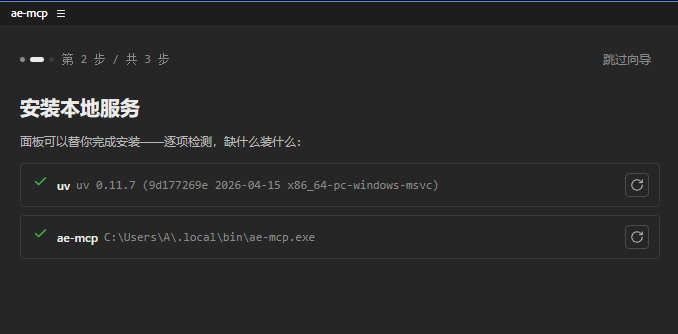
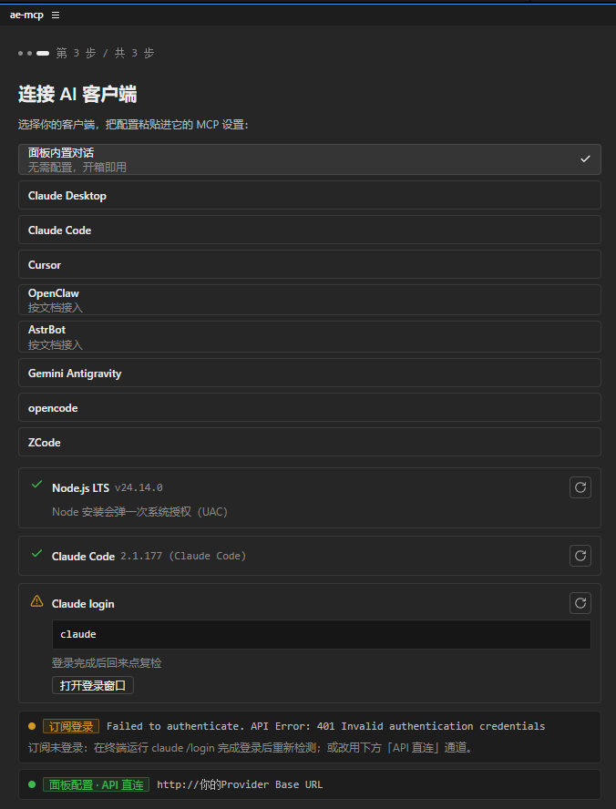
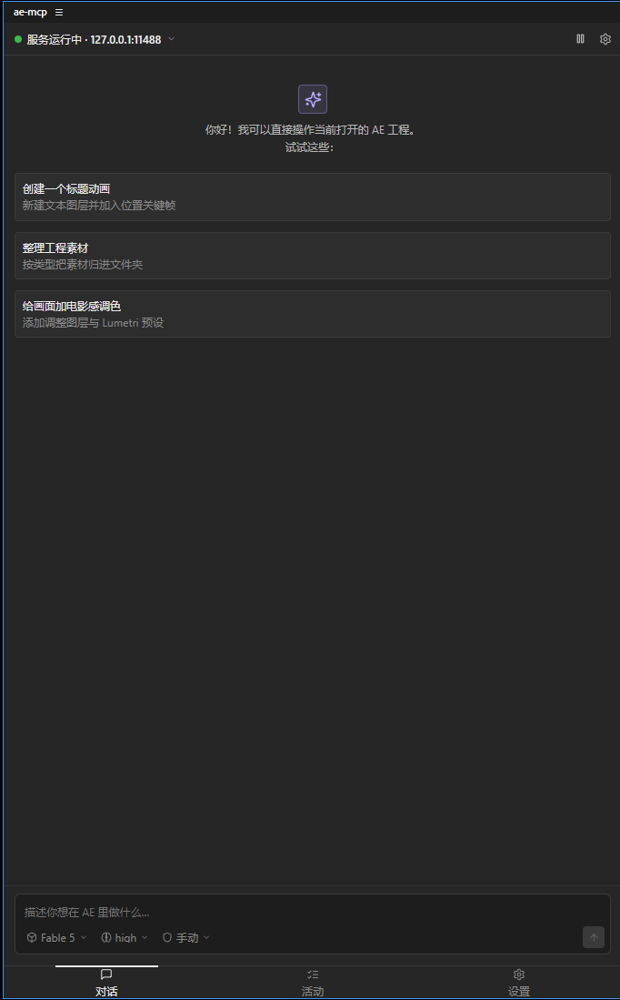
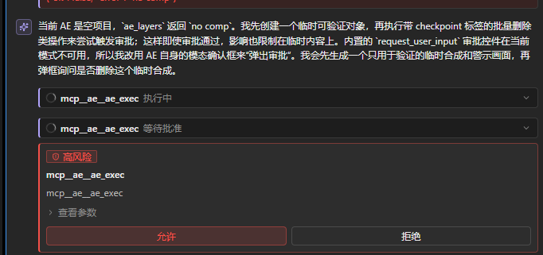
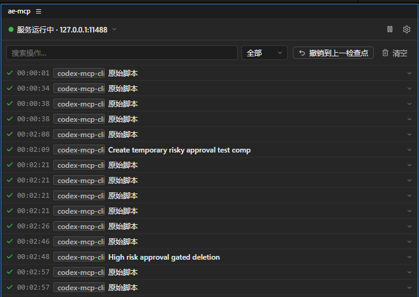

# ae-mcp

[English](README.md) | 简体中文

ae-mcp 是一个**后端无关**的 After Effects 自动化工具，用来让 AE 与 AI agent 保持同一个工作上下文。它通过 MCP server 暴露 AE 工程状态、工具调用、预览、截图和检查点，让 agent 能在对话中理解并操作当前 AE 项目。

MCP server 是核心。在 MCP 本体之外，ae-mcp 还包装了一套 CEP 面板插件，提供面板内对话、后端配置、审批、诊断和首跑安装。你可以根据自己的工作流选择：在外部 agent 后端里通过 MCP 使用 ae-mcp，或者直接在 AE 面板内配置 Claude / Codex / ZCode 后端进行对话。

**v0.9.5 是 Windows x64 修复版本。** 签名 ZXP 内含 CEP 面板与 Windows Platform Helper；签名 AEX 仍需单独手动安装。面板首跑向导可以联网安装外部 Python runtime，因此不要求用户预先装好 runtime，但本版不是离线或只装 ZXP 即用的安装包。

## v0.9.5 目标支持矩阵

v0.9.5 发布资产面向以下范围：

- Windows 11 24H2（11.0.26100）或更新版本，运行于 x64；不支持 Windows ARM。
- After Effects 2025 是本次打包验收宿主；AE 2026 已在真机 **Windows** 上验证（macOS 尚无任何真机验收）。AE 2023/2024 为**静态兼容、真机未验**：AEX 的全部 AEGP suite 钉在 AE 2023 基线（#215），CEP manifest 覆盖 `[23.0,26.9]`，但 Adobe Creative Cloud 仅分发当前与前一个大版本，维护者已无法获取 2023/2024 安装器——真机验收开放社区众测（#236）。这是供应商分发限制，不是已知不兼容。
- v0.9.5 的 GitHub Release 页在 Windows 资产之后补充了 macOS arm64 资产：**未签名**平台包（`ae-mcp-platform-bundle-v0.9.5-macos-arm64-unsigned.zip`）、原生插件压缩包与独立校验和文件。它们未签名/未公证，也未经过 macOS 真机验收。

## 架构

```text
面板内对话或外部 MCP 客户端
  -> packages/core (ae_mcp, Python stdio MCP server, 16 个公开工具)
  -> backend (packages/bridge, httpx)
  -> CEP panel Node host (plugin/host, Express, 127.0.0.1:11488)
     -> native RPC -> AEGP 主线程 dispatcher
     -> CSInterface.evalScript -> ExtendScript（`ae_exec`）
  -> After Effects
```

`ae_previewFrame` 仍是 AE 内部的 `CompItem.saveFrameToPng` 路径，用于渲染真实合成像素，viewer snapshot 只作为 fallback。`packages/snapshot-mss` 通过 `mss` backend 提供 Windows `ae_snapshot` 屏幕捕获。

MCP core 本身保持后端无关：外部客户端可以通过 stdio server 与 AE 对话，CEP 面板也可以在 AE 内承载内嵌 agent 对话。现有面板层负责后端配置、审批、诊断和活动历史。v0.9.5 ZXP 恢复 Provider 管理器和 Windows Credential Manager 所需的 Platform Helper，但不内置 Python，也不激活 Windows RuntimeManager。Claude、Codex、ZCode 是面板内置后端；OpenCode 和其他工具仍可以作为外部 MCP 客户端接入。

## v0.9.5 发布范围

- ZXP 与 AEX 必须来自最终受保护 `main` 的同一个 SHA；源码变化后必须重新生成资产和校验值。
- ZXP 包含既有 Windows Platform Helper，并在签名前校验其 manifest、文件清单与哈希。
- ZXP installer 不会把包内文件复制到 AE 原生插件目录，因此 AEX 单独发布并手动安装。
- 首跑向导会在缺少依赖时联网安装 `uv` 与按 v0.9.5 tag 固定的外部 runtime。内置/离线 Python、一体化安装器、自动 AEX 部署、Windows RuntimeManager、修复/回滚/卸载生命周期、**已签名/公证的** macOS 资产和 Windows ARM 不属于本版范围；未签名的 macOS arm64 平台包与原生插件为后补上传，未经 macOS 真机验收。
- 两类签名均使用本次新建的自签名身份，不代表公开可信的软件发布者。

## 安装和首次启动

从 v0.9.5 GitHub Release 下载以下三个固定文件，不要用源码归档替代签名资产：

| 用途 | 发布资产 |
|---|---|
| CEP 面板 + Windows Platform Helper | `ae-mcp-panel-v0.9.5-windows-x64.zxp` |
| 原生 AEGP 插件 | `AeMcpNative-v0.9.5-windows-x64.aex` |
| 完整性校验 | `SHA256SUMS-v0.9.5.txt` |

用受支持的 ZXP installer 安装 ZXP。关闭 After Effects 后，以管理员权限把 AEX 复制为所选宿主的 `Support Files\Plug-ins\Extensions\AeMcpNative.aex`，再重启 AE 并打开 `Window -> Extensions -> ae-mcp`。如果缺少 `uv` 或 `ae-mcp`，在首跑向导中联网安装；向导会执行固定到 v0.9.5 tag 的 `uv tool install`。已有兼容 launcher 会直接复用。

用 `SHA256SUMS-v0.9.5.txt` 校验两个二进制。详见[安装文档](docs/INSTALL.md)和[发布文档](docs/RELEASE.md)。

## 选择并登录后端

ae-mcp 是后端无关的。面板内对话支持三类内嵌后端，按你的账号和工作流选择即可。

| 后端 | 适合场景 | 登录 / 配置方式 |
|---|---|---|
| Claude | 通过 Claude 订阅或 API 直连在面板内运行 agent。 | 可选通道依赖：Claude Code CLI（`claude`）及其登录态；API 直连改用 Anthropic API key 或兼容 provider。 |
| Codex | 通过 Codex CLI、Codex 配置继承，或 OpenAI-compatible provider 在面板内运行 agent。 | 可选通道依赖：Codex CLI 与 `codex login`；provider 模式不依赖该 CLI。 |
| ZCode | 在面板内使用 ZCode provider。 | 可选通道依赖：受支持 ZCode 安装提供的 ZCode CLI/app-server；API-key provider 与它分离。 |

这里的 Claude Code 指 Claude Code CLI，不是 Claude Desktop。Claude Desktop 里配置的 MCP 插件不会被内嵌 Claude 后端读取。Codex 也类似：面板读取的是 Codex CLI 状态，或者 ae-mcp 自己的 Provider 管理器配置。

## 主面板

面板最常用的是内嵌对话。你可以直接输入提示词，让 agent 检查工程、创建图层、改属性、写表达式、预览画面或执行更复杂的 AE 自动化任务。

Composer 快捷控制包含：

- 模型选择，带成本标识；会话内切换模型不会清空对话。
- 思考深度，对应后端原生 effort / reasoning 档位。
- 快速模式，用更高 token 消耗换更快响应，具体成本取决于后端厂商定价。
- 审批模式，用于控制工具调用放行策略。

Tools 标签页管理本地生成的 JSX、表达式、提示词 skill、recipe 和诊断制品。Index/Search 只展示摘要，Inspect 后才读取完整内容；这里没有云同步。

### 审批四档

审批语义由工具 annotations 驱动，跨后端保持一致。

| 模式 | 行为 |
|---|---|
| 只读 | 只放行读取类操作。 |
| 手动 | 读取自动放行；write、destructive、external 操作需要确认。 |
| 自动 | 常规操作自动放行，高风险操作仍会拦下确认。 |
| 免审 | 普通工具按既有免审策略放行；Tool Library 的 destructive/external 计划仍必须逐次确认。 |

## 活动流与安全

- 活动流会记录 agent 执行过的操作，方便回看发生了什么。
- Kill switch 可以一键熔断所有 AI 操作，发现方向不对时可以立刻停手。
- 撤销仍走 AE 自己的 Undo 体系。插件会尽量把操作封装进 undo group，通常可以直接在 AE 里 `Ctrl+Z`。
- 对风险较高的大改，建议使用 `ae_checkpoint` 或在 `ae_exec` 中传入 `checkpoint_label`，后续可通过 `ae_revert` 回到检查点。检查点功能需要 AE 工程先保存到磁盘。
- 当前诊断页检查 host、访问 token、Python 客户端信号、AE project、ExtendScript ping、可选通道 CLI，以及 macOS 开发版本中经过校验的 RuntimeManager 状态。
- 日志导出可以把面板日志、host 信息和 sidecar tail 汇总出来，方便提交 issue 时定位问题。

## 设置项

设置页主要包含：

- 后端凭证通道：Claude / Codex / ZCode 各自的登录状态、API key、provider 和通道优先级。
- Provider 管理器：新增、编辑、删除 OpenAI-compatible 与 Anthropic provider，并通过 `/v1/models` 探测模型列表；可改项支持展开和收起。
- MCP 配置生成：为 Claude Desktop、Claude Code、Cursor、OpenCode、OpenClaw、AstrBot、Gemini Antigravity、ZCode 等外部客户端生成配置。
- 访问 token：面板与 agent 后端之间的握手密钥，普通用户通常不用手动修改。
- 连接来源管理：查看尝试连接面板的后端名称，必要时屏蔽预期外来源，避免串线。
- AE 专家防错指导：在会话开始时向 agent 注入 AE 命令和数据结构提示，以减少脚本错误。它会占用额外输入 token，可按需关闭。

## 截图

<table>
  <tr><td><br>设置页：后端通道与收起状态的 Provider 管理器</td><td><br>设置页：展开编辑 provider，本地保存 API key</td></tr>
  <tr><td><br>设置页：通用选项、界面语言、日志与关于</td><td><br>首跑向导：在线安装 `uv` 与按版本固定的外部 runtime</td></tr>
  <tr><td><br>首跑向导：选择面板内对话或外部 MCP 客户端</td><td><br>聊天首页：启动建议与 composer 快捷选择条</td></tr>
  <tr><td><br>工具审批卡片：高风险操作确认</td><td><br>活动流：agent 操作历史</td></tr>
</table>

## 通过 MCP 接入外部客户端

面板内对话覆盖 Claude、Codex、ZCode 三类后端。如果你使用 Cursor、Claude Desktop、Claude Code、OpenCode、OpenClaw、AstrBot、Gemini Antigravity、ZCode 等外部客户端，可以通过面板生成的 MCP config 接入。

使用默认 `uv tool install` 时，把 `<USER>` 替换为实际账户名后的外部 launcher 配置形态如下：

```json
{
  "mcpServers": {
    "ae": {
      "command": "C:\\Users\\<USER>\\.local\\bin\\ae-mcp.exe",
      "env": {
        "AE_MCP_BACKEND": "ae-mcp",
        "AE_MCP_PLUGIN_URL": "http://127.0.0.1:11488"
      }
    }
  }
}
```

优先复制面板生成的配置，因为 `UV_TOOL_BIN_DIR` 可能改变 launcher 位置。runtime 仍位于 ZXP 外部，但首跑向导可以联网安装它。详见[安装文档](docs/INSTALL.md)。

关键限制：ae-mcp 默认通过 `127.0.0.1:11488` 连到 AE 面板，所以外部客户端必须和 After Effects 在同一台机器上，或者能访问 AE 所在机器的这个端口。OpenClaw、AstrBot 这类常驻或 Docker 化的 IM-bot 框架尤其要注意。

## 工具能力

| 分类 | 公开工具 |
|---|---|
| 执行 | `ae_exec`、`ae_nativeExec` |
| 画面 / 表达式验证 | `ae_previewFrame`、`ae_validateExpressions` |
| Undo / 恢复 | `ae_checkpoint`、`ae_revert`、`ae_snapshot` |
| Skill 库 | `ae_skillList`、`ae_skillUse` |
| Tool 库 | `ae_toolIndex`、`ae_toolSearch`、`ae_toolInspect`、`ae_toolUse` |
| 诊断 | `ae_ping`、`ae_status`、`ae_diagnose` |

`ae_exec` 是维护中 ExtendScript 语义的默认执行路径。`ae_nativeExec` 只接受
由统一 catalog 生成的精选 AEGP primitive。需要路由、program 组合、readback、
不确定写入核对和真实 Undo 验证时，加载
`builtin:skill:ae-execution-guide`。

原生 program 最多包含 64 个有序 operation。resolver 保存的值只在本次请求内
有效；下一次请求必须用稳定 locator 重新解析。写 program 必须提供
`operationKey` 与 `undoGroup`，然后独立读取验证。可能已产生副作用的结果在
核对 AE 状态与审计证据前不得重试。

统一 primitive catalog 位于
`native/ae-plugin/protocol/native-primitives.json`；也可通过 Skill 库加载默认
执行指南查看生成的 reference。Tool 库只保留渐进式 Index、Search、Inspect、Use。
## 使用建议

AI 目前还不能稳定替代动效师、合成师或设计师的最终判断。更可靠的使用方式是分工协作：

- 人来负责审美把控、画面方向、基础工程结构和最终合成判断。
- AI 更适合处理重复性操作、结构相似工程的批量处理、逻辑性强的程序化动画、表达式编写、工程整理，以及在画面不变的前提下重构工程结构。

做视觉任务时，建议让 agent 多用 `ae_previewFrame` 检查中间结果。做大范围修改前，建议先建检查点。

## 开发

开发部署前必须关闭全部 After Effects / AfterFX 进程。CEP 安装器按自己的备份流程预检并暂存面板；
下文的原生 AEGP 安装器会独立验证制品，并返回用于精确回滚的事务 ID。

### 原生 AEGP SDK 输入

Adobe After Effects C/C++ Plug-in SDK **不随本仓库分发**，项目也不会自动下载它。开发者必须前往 Adobe 官方
[After Effects Developer 页面](https://developer.adobe.com/after-effects/)，通过 **Get the SDKs** 自行取得匹配版本，并解压到仓库之外。当前原生输入固定为 After Effects SDK **25.6、build 61、64 位**：

| 平台 | 预期外层压缩包 | 字节数 | SHA-256 |
|---|---|---:|---|
| macOS | `AfterEffectsSDK_25.6_61_mac.zip` | 2,039,255 | `c6abccd52ae25936b819b78c4fea2858bd161f216f72f75184fe9ec55a49756e` |
| Windows | `AfterEffectsSDK_25.6_61_win.zip` | 7,549,997 | `3d3a39175a09d07f6f9734284636f9eadce968b05161650e3cba097a95905330` |

将 `AE_SDK_ROOT` 指向本地解压得到的 `ae25.6_61.64bit.AfterEffectsSDK` 目录（或它的直接父目录），并将
`AE_SDK_ARCHIVE` 指向原始外层压缩包。任何原生构建前都要同时校验压缩包身份和解压后的布局/内容：

```bash
export AE_SDK_ARCHIVE=/绝对路径/AfterEffectsSDK_25.6_61_mac.zip
export AE_SDK_ROOT=/绝对路径/ae25.6_61.64bit.AfterEffectsSDK
node scripts/package/ae-sdk-input.mjs verify-input --platform macos-arm64
```

Windows 输入使用 `windows-x64`。输入缺失时会明确返回
`AE_SDK_ROOT_REQUIRED`/`AE_SDK_ARCHIVE_REQUIRED`；压缩包字节不匹配返回
`AE_SDK_ARCHIVE_INVALID`；解压目录版本、布局或内容不匹配返回 `AE_SDK_LAYOUT_INVALID`；平台尚无已建立并复核的固定内容锁时返回
`AE_SDK_CONTENT_EVIDENCE_PENDING`。Windows 根目录内容证据目前仍待建立，因此会安全地拒绝构建。

不要把 SDK 压缩包、头文件、示例、PDF、PiPLtool 或包内附带的解包脚本/二进制提交到 GitHub，**也不要提交到 Git LFS**。公开 CI 只运行防误提交检查，从不接收 SDK。完整要求见
[SDK 引入、校验与分发策略](docs/native-sdk/SDK_INPUTS.md)。

#### 在 macOS 上构建并安装原生 AEGP host

这是原生 AEGP 的开发流程，与下方 CEP 面板安装器相互独立。目前只构建 Apple Silicon arm64
目标。请先提交产品源码：用于取证的构建要求整个工作树干净，否则会以
`AE_PLUGIN_SOURCE_DIRTY` 安全失败，从而确保回执能标识原生组件源码。为防止绕过事务安装器，输出必须是
canonical `/private/tmp` 下尚不存在的绝对目录，并且位于所有 Git worktree、Git common directory 和 SDK
根目录之外。

```bash
BUILD_DIR=/private/tmp/ae-mcp-native-73
node native/ae-plugin/build-macos.mjs \
  --sdk-archive "$AE_SDK_ARCHIVE" \
  --sdk-root "$AE_SDK_ROOT" \
  --output "$BUILD_DIR"
node native/ae-plugin/verify-macos.mjs \
  --bundle "$BUILD_DIR/AeMcpNative.plugin"
```

本地开发仅接纳同一用户、且进程祖先链能够追溯到当前正式版 After Effects host 的客户端。
原生 challenge 仍会绑定 endpoint 与 peer 身份，但单用户开发路径不再使用连接码、指纹确认或构建开关。
例行启动与验收按组件集记录各自的源码 revision 和安装回执，并校验 canonical path、组件/协议版本、
文件大小、mode 与修改时间等有界信号；只有观察到矛盾、或明确执行 release/security 审计时才升级为内容哈希。

安装前必须关闭所有 After Effects、AfterFX 和 aerender 进程。开发安装器会校验回执结构、产品版本、
协议元数据、平台、架构、入口点、签名和安装后的副本，
最终安装位置为
`~/Library/Application Support/Adobe/Common/Plug-ins/7.0/MediaCore/ae-mcp/AeMcpNative.plugin`：

```bash
node native/ae-plugin/install-dev-macos.mjs install \
  --artifact-dir "$BUILD_DIR"
```

默认的 `development` 身份档会记录源码 revision，但不会仅因源码提交或已记录 payload 哈希不同而拒绝
其他方面兼容的本地构建。由于目前没有版本兼容区间，产品版本相等仍是硬门禁。显式 release/security
审计使用 `--profile release-audit`，它恢复 exact-source、exact-receipt 和 exact-artifact 校验；
发布工作流会自行选择该档。

MediaCore 命名空间采用严格约束：事务进行中允许为空，其余时间只能包含当前生效的
`AeMcpNative.plugin`。事务记录以及完整的 stage、backup、failed、replaced bundle 全部保存在 Adobe
扫描根之外的 `~/Library/Application Support/AfterEffectsMCP/native-plugin-dev-v1/`。AE 关闭时，安装器会先把
完整的旧命名空间移入扫描区外的隔离区，再只恢复当前生效的 bundle；迁移在各个中断边界都可继续恢复。
仅添加 `.disabled` 后缀不再被视为可靠隔离。写入中断后可安全处理的元数据或暂存残留会保存在同一状态根的
`orphan-evidence/`；如果不完整记录已被部署证据引用，恢复会拒绝猜测并保持失败关闭。

安装、恢复、回滚以及过期 owner 的接管由一个持久的 Darwin 内核 guard 串行化。不要同时运行旧 checkout
中的安装器：安装器会拒绝已观察到的旧版存活锁，但跨版本安装器并不共享新的 guard 协议。

请保留输出中的 `transactionId`。关闭 AE 后，可精确回滚当前这笔事务：

```bash
TRANSACTION_ID="在这里粘贴安装输出中的 transactionId"
node native/ae-plugin/install-dev-macos.mjs rollback \
  --transaction "$TRANSACTION_ID"
```

如果安装器进程曾在事务阶段之间被中断，请保持 AE 关闭，并在重试前根据持久化记录恢复一致状态：

```bash
node native/ae-plugin/install-dev-macos.mjs recover
```

Ad-hoc 签名和本地构建成功只属于开发证据。生成的回执会刻意保持
`distributionApproved`、`runtimeEvidence` 和 `compatibilityEvidence` 为 false；每个候选仍必须通过
公开 AE 执行面只保留两条路径：维护中的 AE scripting object model 能完成的操作
使用 `ae_exec`；只有精确原生图结构、时间、有理数或属性语义才使用
`ae_nativeExec`。组合非平凡请求前先加载 `builtin:skill:ae-execution-guide`。

原生请求是一个有界、线性的 `operations` 数组。resolver 产生带类型且仅在本次
请求内有效的 handle，后续 operation 用 `{"ref":"name"}` 引用。handle 不会序列化，
也不会跨请求存活；后续请求必须用稳定 locator 重新解析。只读 program 不携带
`operationKey` 和 `undoGroup`；包含写入的 program 两者都必填，在一个真实 AE Undo
group 中执行，但不承诺原子性。

每次写入后都要用独立读取验证。若结果可能已产生副作用，必须先结合 AE 状态和
审计证据核对，再决定是否重试。Undo 可用不等于 Undo 已验证：必须真正执行 Undo，
再用独立读取证明状态恢复。

生成的 primitive reference 已进入默认执行指南。唯一手工维护的 catalog 是
`native/ae-plugin/protocol/native-primitives.json`；使用
`uv run python scripts/generate_native_exec.py --check` 校验全部生成投影。

CEP 面板 macOS 开发环境：

```bash
uv sync --all-packages --group dev
(cd plugin/host && npm ci)
(cd plugin/sidecar && npm ci)
(cd plugin/panel && npm ci && npm run build)
./scripts/install-plugin-dev-macos.sh
```

Windows 开发环境：

```powershell
uv sync --all-packages --group dev
cd plugin\host
npm ci
cd ..\sidecar
npm ci
cd ..\panel
npm ci
npm run build
cd ..\..
.\scripts\install-plugin-dev.ps1
```

## 测试

非 live 测试：

```powershell
uv run pytest
```

live 测试需要 AE 打开且 ae-mcp 面板运行：

```powershell
$env:AE_MCP_LIVE_TESTS = "1"
$env:AE_MCP_BACKEND = "ae-mcp"
$env:AE_MCP_PLUGIN_URL = "http://127.0.0.1:11488"
uv run pytest packages/core/tests/live -o addopts='' -vv
```

模型矩阵 smoke（Claude sidecar + Codex app-server）：

```powershell
node scripts/live-model-matrix.mjs
```

## 打包与发布

维护者先合并发布元数据，再从最终干净的受保护 `main` 提交构建 v0.9.5 Windows Helper、ZXP 与 AEX。校验最小 ZXP 载荷后分别签名、复验并生成 `SHA256SUMS-v0.9.5.txt`，通过 After Effects 2025 Helper/Provider 与公开 MCP 路径 smoke 后原样上传，不重新构建。完整流程见 [docs/RELEASE.md](docs/RELEASE.md)。

## 贡献者

带着根因一起来的 bug 报告，以及在维护者没有的硬件上做的验收，对这个项目的推动不亚于补丁。两者都记在 [CONTRIBUTORS.md](CONTRIBUTORS.md)。

## 实现说明

第三方组件：

- `plugin/client/CSInterface.js` 是 Adobe CEP `CSInterface` v11，文件内保留 Adobe 原始许可声明。
- `ae-mcp-snapshot-mss` 使用 `mss` 和 Pillow 做屏幕截图。
- Python bridge 使用 `httpx`；CEP host 使用 Express；面板 UI 使用 React；Claude sidecar 使用 Claude Agent SDK。

## 开源协议

ae-mcp 项目代码使用 MIT License，见 [LICENSE](LICENSE)。

带有上游许可声明的文件，例如 Adobe `CSInterface.js`，按其文件内许可声明执行。
