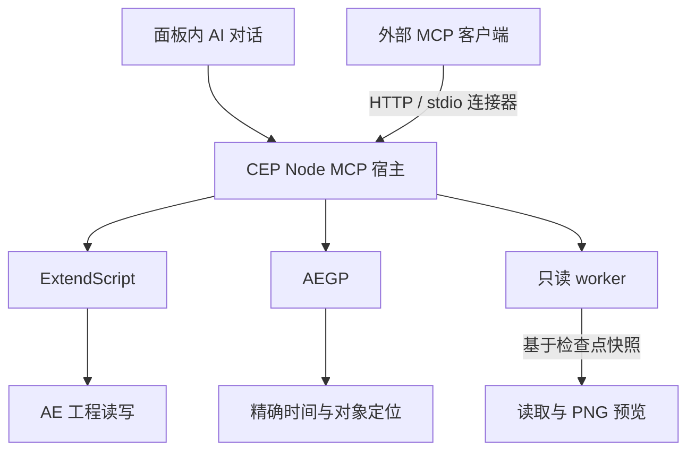

# ae-mcp

[English](README.md) | 简体中文

<details open>
<summary>自动配置：复制安装提示词给你准备使用的 MCP 客户端</summary>

```text
请为正在接收并执行此提示词的当前客户端安装、配置 ae-mcp。
不要默认选择 Claude Code，也不要配置其它客户端。
操作前先只读检查本机 ae-mcp 扩展、原生插件的文件与版本，以及当前客户端
已有的 MCP 注册和实际连接状态；不要仅凭文件或条目存在就认定可用。
对照官方最新稳定发布中本平台可用的资产，按检查结果处理：
- 客户端已正确注册：保留配置，只补装缺失或损坏的文件。
- 文件完整且版本适用：只补配缺失或错误的客户端注册。
- 两者都已就绪且为最新版：直接验证，不重复安装。
- 有可用新版：升级已有组件，保留用户设置及其它 MCP 配置，不降级。
  无法确认版本或缺少本平台资产时说明情况，不盲目覆盖。
需要安装或升级文件时使用发布页的 ZXP 和对应平台原生插件，然后在
After Effects 中打开 Window > Extensions > ae-mcp。
先确定当前客户端的配置方式与位置，
保留已有的其它 MCP 条目。支持 Streamable HTTP 时接入
http://127.0.0.1:11488/mcp；仅支持 stdio 时按当前客户端格式配置
`npx -y ae-mcp-jkdg`。无法自动修改时给出当前客户端准确的手动步骤。
只有确实无法识别目标客户端时才询问，不要静默回退到 Claude Code。
保持 AE 面板打开，按当前客户端要求刷新、重连或新建会话，再调用 ae_status
验证；需要我先操作时，说明验证尚未完成。
```

</details>

**让 AI 在 After Effects 中读取工程、制作动画、查看结果，并把成功的操作保存为可复用工具。**

ae-mcp 是安装在 After Effects 内的开源 CEP 扩展，将正在打开的工程接入
Model Context Protocol（MCP）。你可以在面板里与 Claude、Codex、OpenCode
对话，也可以连接外部 MCP 客户端，让 AI 操作合成、图层、关键帧与表达式。

[下载 v0.11.0](https://github.com/JUNKDOGE-JOE/after-effects-mcp/releases/tag/v0.11.0)
· [安装指南](docs/INSTALL.md) · [工具参考](docs/REFERENCE.md) · [更新日志](CHANGELOG.md)

## 能做什么

- **读取真实工程**：按需读取工程、合成、图层、属性和关键帧，支持分页、排序与过滤。
- **执行动画操作**：通过 ExtendScript 创建和修改 AE 内容；需要精确时间与对象定位时使用原生 AEGP 工具。
- **查看合成像素**：从 AE 导出 PNG，支持单帧、多时间点拼图和 A/B 像素差分，供 AI 检查修改结果。
- **恢复失败操作**：结合已保存工程的检查点、失败脚本与 `recoveryId`，核对状态后修正或回退。
- **积累可复用工具**：成功脚本自动捕获为候选，可重放、保存、置顶、归档及导入导出；也支持提示词技能。
- **管理执行过程**：面板内提供操作审批、活动时间线、会话历史和诊断导出。

这套流程把“读取 → 执行 → 预览 → 修正 → 保存复用”放在同一会话中。
AI 通过 AE 宿主获取当前状态，包括尚未保存的修改；工程结构读取与画面预览共同用于验证结果。

## 看一次完整流程

可以先在测试工程中给 AI 这样的任务：

```text
在新合成中创建一行 Hello AE 文字，让它在 1 秒内从透明渐显，
同时从下方向上移动到画面中央。完成后读取关键帧，并用多帧预览检查动画。
```

下图展示任务输入、六帧预览结果，以及成功脚本自动进入工具库的过程。
截图为 **v0.10.7 的实际界面**，用于展示工作流程；v0.11.0 的新增能力见下节。

<table>
  <tr><th>描述任务</th><th>查看预览结果</th><th>保存为可复用工具</th></tr>
  <tr>
    <td><a href="docs/assets/readme/chat-input.png"></a></td>
    <td><a href="docs/assets/readme/preview-result.png"></a></td>
    <td><a href="docs/assets/readme/tool-library.png"></a></td>
  </tr>
</table>

## v0.11.0 更新

- **多实例与并行预览**：外部客户端可发现、启动和路由到多个 AE 实例。不同工程可并行操作；同一工程保留一个活动写入者，只读 worker 基于固定检查点快照执行读取与预览。
- **会话交接**：面板回合结束或外部 AE 调用完成后，其他有写入资格的会话可接管空闲工程；执行中、引擎排空或写入结果未知时继续保护工程。
- **AI 工作目录**：新聊天默认使用当前 AEP 所在目录；工程未保存或目录不可写时回落用户目录。设置中可选择目录或恢复默认，已有聊天保留原目录。
- **Undo 与恢复修复**：修复撤销组不匹配和检查点恢复上下文问题；渲染需拆成独立、不带 Undo 分组的调用。
- **原生连接与 worker 稳定性**：改进原生冷启动诊断、连接超时重试、Windows 后台 worker 启动与退出清理。
- **公开工具从 13 个增至 16 个**：新增 `ae_instances`、`ae_workspace`、`ae_readJob`；配套 stdio 连接器为 `ae-mcp-jkdg@0.11.0`。

该版本已发布 Windows ZXP、Windows x64 原生插件与校验文件；macOS arm64 原生发布包尚未提供，
最终 Mac 包安装与 worker 验收尚未完成。完整验证范围与已知限制见
[v0.11.0 发布说明](https://github.com/JUNKDOGE-JOE/after-effects-mcp/releases/tag/v0.11.0)。

<a href="https://glama.ai/mcp/servers/@JUNKDOGE-JOE/after-effects-mcp">
  
</a>


## 安装和首次启动

1. 从 [v0.11.0 发布页](https://github.com/JUNKDOGE-JOE/after-effects-mcp/releases/tag/v0.11.0)
   下载并安装 `ae-mcp-panel-v0.11.0.zxp`。
2. 如需 `ae_nativeExec`，将同一发布中的 `AeMcpNative-v0.11.0-windows-x64.aex`
   单独安装到目标 AE 的插件目录。原生插件不包含在 ZXP 内；具体路径见[安装文档](docs/INSTALL.md)。
   ZXP 随附 Windows OpenCode 运行时，约 60 MB。macOS 使用 PATH 中的 OpenCode；
   Mac 原生包与完整安装验证以发布页后续提供的资产为准。
3. 启动 After Effects，打开 **Window > Extensions > ae-mcp**。外部客户端
   使用 MCP 时保持面板打开。
4. 在面板设置中配置 Claude、Codex 或 OpenCode 通道，或按下节连接外部客户端。

面板本身就是 MCP 服务，不需要单独启动仓库服务器。外部客户端默认通过
loopback 访问，所以必须和 After Effects 在同一台机器上运行。

## 客户端接入

连接单个已运行的面板时，支持 Streamable HTTP 的客户端可直接使用面板显示的 URL。
默认地址的 Claude Code 配置示例：

```bash
claude mcp add --transport http ae http://127.0.0.1:11488/mcp
```

需要多实例发现与启动，或使用 Claude Desktop 等 stdio 客户端时，使用配套连接器
（需要 Node.js 18 或更高版本）：

```json
{
  "mcpServers": {
    "ae": {
      "command": "npx",
      "args": ["-y", "ae-mcp-jkdg@0.11.0"]
    }
  }
}
```

未指定 URL 时，连接器发现已安装扩展的多实例入口；它本身不安装或更新扩展。
先通过 `ae_instances` 发现或明确启动实例，再用 `ae_workspace` 绑定工程，
后续 AE 调用携带返回的 `context_id`。指定 `--url` 或 `AE_MCP_HTTP_URL`
则固定转发到单个端点。关闭面板代表主动断开，不会自动重开 AE。

也可以直接运行安装扩展中自带的无依赖 stdio shim。以下示例固定连接一个端点；`command` 填系统 Node
可执行文件，`args` 指向扩展目录中的 `host/stdio-shim.js`：

```json
{
  "mcpServers": {
    "ae": {
      "command": "node",
      "args": ["<已安装扩展目录>/host/stdio-shim.js"],
      "env": {
        "AE_MCP_HTTP_URL": "http://127.0.0.1:11488/mcp"
      }
    }
  }
}
```

配置完成后刷新或重连客户端，并调用 `ae_status` 验证。

## 工作原理

MCP 服务直接运行在 CEP 面板的 Node 宿主中，默认地址为
`http://127.0.0.1:11488/mcp`；多实例使用各自登记的端点。
宿主统一管理审批、工程上下文、工具库和日志。


```mermaid
flowchart TB
    panel["面板内 AI 对话"] --> host["CEP Node MCP 宿主"]
    client["外部 MCP 客户端"] -->|"HTTP / stdio 连接器"| host

    host --> jsx["ExtendScript"]
    host --> native["AEGP"]
    host --> worker["只读 worker"]

    jsx --> project["AE 工程读写"]
    native --> precision["精确时间与对象定位"]
    worker -->|"基于检查点快照"| preview["读取与 PNG 预览"]
```

常规操作走 ExtendScript；原生 AEGP 平面保留 23 个固定原语，提供精确有理数时间与
绑定对象代次的 locator。多实例并不允许多个会话同时写入同一工程，worker 返回的也始终是
指定检查点的快照结果。详见[架构方向](docs/ARCHITECTURE_DIRECTION.md)。

## 面板能力

CEP 宿主公开 16 个 MCP 工具：

| 领域 | 工具 |
| --- | --- |
| 状态 | `ae_status` |
| ExtendScript 与恢复 | `ae_exec`、`ae_execRecover` |
| 读取与视觉验证 | `ae_read`、`ae_previewFrame`、`ae_validateExpressions` |
| 工程检查点 | `ae_checkpoint`、`ae_revert` |
| 冻结的原生 AEGP | `ae_nativeExec` |
| Tool Library 与技能 | `ae_toolSearch`、`ae_toolUse`、`ae_toolSave`、`ae_skillUse` |
| 实例、工程上下文与只读任务 | `ae_instances`、`ae_workspace`、`ae_readJob` |

`ae_exec` 和 `ae_execRecover` 成功后会把脚本捕获为去重、可重放的 Tool
Library candidate。`ae_toolSave` 可沉淀或新建可复用 JSX 与 prompt-skill；工具页
集中管理候选和已保存工件，并支持导入/导出。使用计数与漏斗事件记录哪些工件被
重放或保留；占位符守卫会把历史压缩后的对话指回精确候选，并切断重复占位符重试。

面板还提供审批档位、活动记录、诊断、日志导出，以及 Claude、Codex、OpenCode
内嵌通道。宿主持久状态默认位于 `~/.ae-mcp`；开发与测试可用
`AE_MCP_STATE_DIR` 整体迁移。

公开 MCP 工具由 CEP 宿主提供。写入后应独立读取验证；可能产生副作用的
失败必须先核对再重试，Undo 的可用性和实际执行后的验证是两件事。
同步 ExtendScript 的超时不保证立即中断执行；PNG 预览可能不包含 Guide 图层。
多帧与差分参数、恢复规则及快照任务用法见[工具参考](docs/REFERENCE.md)。

## 开发

安装两个 Node workspace 并构建面板：

```bash
(cd plugin/host && npm ci)
(cd plugin/panel && npm ci && npm run build)
```

构建完成后，用平台脚本进行本地 CEP 部署：

```powershell
.\scripts\install-plugin-dev.ps1
```

```bash
./scripts/install-plugin-dev-macos.sh
```

Adobe After Effects C/C++ Plug-in SDK 由开发者自行提供，必须放在仓库外。
构建原生插件前先校验：

```bash
node scripts/package/ae-sdk-input.mjs verify-input --platform macos-arm64
```

冻结的原生平面应构建到仓库外的新目录。安装器把事务状态保存在
`native-plugin-dev-v1` 下；安装后保留输出的事务 ID：

```bash
AE_SDK_ARCHIVE=/absolute/path/AfterEffectsSDK.zip
AE_SDK_ROOT=/absolute/path/AfterEffectsSDK
BUILD_DIR=/private/tmp/ae-mcp-native-dev
TRANSACTION_ID="粘贴安装输出的事务 ID"
node native/ae-plugin/build-macos.mjs \
  --sdk-archive "$AE_SDK_ARCHIVE" \
  --sdk-root "$AE_SDK_ROOT" \
  --output "$BUILD_DIR"
# 安装状态根目录为 native-plugin-dev-v1。
node native/ae-plugin/install-dev-macos.mjs install --artifact-dir "$BUILD_DIR"
node native/ae-plugin/install-dev-macos.mjs rollback \
  --transaction "$TRANSACTION_ID"
```

原生平面已经冻结；AEGP 协议生成文件随仓库保存，普通开发不再运行能力包
代码生成流水线。

## 测试和打包

本地可先运行纯 Node 契约测试：

```powershell
node --test scripts/package/test/verify-windows-zxp-stage.test.mjs
node --test scripts/package/test/zxp-payload-audit.test.mjs
```

Windows ZXP 暂存复制面板、宿主、JSX、shared、图标、宿主生成资产，以及由
`node scripts/package/fetch-opencode-runtime.mjs` 钉版拉取的 OpenCode 运行时；
它精确校验宿主 Express `4.22.2`，并在一次签名步骤中完成 ZXP 签名：

```powershell
.\scripts\package-zxp.ps1 -SkipSigning
```

签名 ZXP 不得包含嵌套原生二进制；随附的 `opencode.exe` 是唯一明确放行的可执行
文件。打包脚本在产物超过 80 MB 时失败，随附运行时后的正式包约 60 MB。

详见[安装文档](docs/INSTALL.md)、[参考](docs/REFERENCE.md)、
[Tool Library](docs/TOOL_LIBRARY.md)、[架构方向](docs/ARCHITECTURE_DIRECTION.md)、
[开发流程](docs/WORKFLOW.md)和[发布文档](docs/RELEASE.md)。

## 赞助者 Sponsors

感谢每一位支持 ae-mcp 开发与维护的赞助者！

自愿赞助，金额随意。你的支持将帮助项目持续开发与维护。

**[通过 PayPal 赞助](https://paypal.me/junkdoge)**

<details open>
<summary>扫码支持：微信支付 / 支付宝</summary>

<p>使用对应的 App 扫码。</p>
<table>
  <tr><th>微信支付</th><th>支付宝</th></tr>
  <tr>
    <td><a href="docs/assets/sponsorship/wechat-pay.jpg"></a></td>
    <td><a href="docs/assets/sponsorship/alipay.jpg"></a></td>
  </tr>
</table>

</details>

### 赞助鸣谢

| 赞助者 | 简介 | 赞助金额 | 备注 |
| --- | --- | --- | --- |
| [**biheye-g**](https://github.com/biheye-g) | B 站 UP 主 **匕禾页** | 18 元 | 首位赞助者 |
| \*青 | 支付宝赞助者 | 30 元 | — |

## 许可证

ae-mcp 使用 MIT License，见 [LICENSE](LICENSE)。Adobe 的 `CSInterface.js`
保留其上游许可声明。
