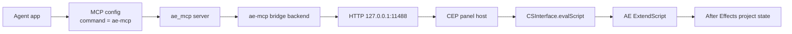
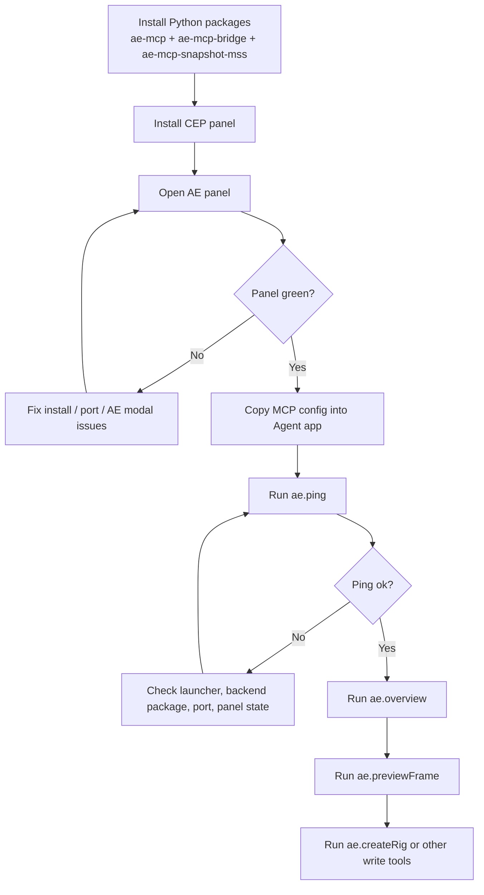
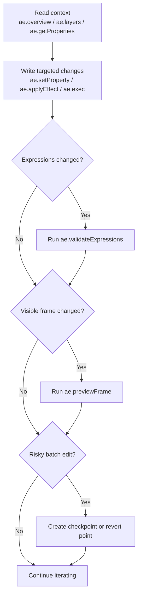

# ae-mcp 工作流 / Workflow

## 中文

这份文档描述的是“Agent + MCP + AE 插件”如何一起工作，不是安装细节本身。安装步骤见 [docs/INSTALL.md](INSTALL.md)。

## 1. 架构同步

```text
Agent app
  -> MCP config (`ae-mcp`)
  -> ae_mcp server
  -> ae-mcp bridge backend
  -> HTTP 127.0.0.1:11488
  -> CEP panel host
  -> CSInterface.evalScript
  -> AE ExtendScript
```



每一层各自负责：

- Agent app：发起工具调用，例如 `ae.previewFrame`、`ae.createRig`、`ae.exec`。
- `ae-mcp`：暴露 MCP tool surface，做 schema 校验和 handler 路由。
- `ae-mcp-bridge`：把 handler 的 AE 调用转成对本地面板的 HTTP 请求。
- CEP panel：常驻在 AE 内，接收 HTTP 请求并把 JSX 投给 ExtendScript。
- ExtendScript：在 AE 里真正读取项目、改图层、写表达式、创建 rig。

## 2. 首次接通

推荐第一次按这个顺序验证：

1. 装好 Python 侧 `ae-mcp`、`ae-mcp-bridge`、`ae-mcp-snapshot-mss`。
2. 安装并打开 AE 面板。
3. 确认面板绿灯，端口正确。
4. 把面板里的 `MCP config` 复制到 Agent 客户端。
5. 在 Agent 里运行 `ae.ping`。
6. 通过后再跑 `ae.overview`、`ae.previewFrame`、`ae.createRig`。

建议不要一上来就让 Agent 执行复杂 JSX。先用 `ae.ping` 和只读工具确认链路通了，再做写操作。



## 3. 日常使用节奏

比较稳的一条工作流是：

1. 先用只读工具建立上下文。  
   常用：`ae.overview`、`ae.layers`、`ae.getProperties`、`ae.scanPropertyTree`  
   大型 comp 可给 `ae.layers` 传 `format='text'` + `offset`/`limit`，输出更省 token；默认仍一次返回全部图层。

2. 再做窄范围写操作。  
   常用：`ae.setProperty`、`ae.applyEffect`、`ae.createLayer`、`ae.exec`

3. 涉及表达式时先做机器校验。  
   常用：`ae.validateExpressions`

4. 涉及画面变化时再做预览。  
   常用：`ae.previewFrame`

5. 需要回退点时加 checkpoint。  
   常用：`ae.checkpoint`、`ae.revert`

这样做的好处是：

- Agent 先理解 comp 和 layer 结构，再动手，误改更少。
- 表达式错误能在视觉检查前被机器发现。
- `ae.previewFrame` 用来做快速 viewer feedback，而不是替代真实渲染。



## 4. 推荐的 Agent 提示习惯

如果你在用 Codex、Cursor、Claude Code 这类 Agent，推荐让它们遵守这几个顺序习惯：

- 修改前先读：先 `ae.overview` / `ae.layers`，再写。
- 表达式先校验：写完表达式先 `ae.validateExpressions`。
- 预览先快照：先 `ae.previewFrame`，不要默认真实渲染。
- 大改前先 checkpoint：尤其是批量 `ae.exec` 之前。

## 5. 常见故障定位

如果 Agent 看得到工具，但调用失败，通常按这个顺序排：

1. 面板是不是绿灯。
2. `AE_MCP_PLUGIN_URL` 端口是不是和面板一致。
3. Agent 侧 `command` 能不能真的启动 `ae-mcp`。
4. 当前 Python 环境里有没有 `ae-mcp-bridge`。
5. AE 里是不是有模态弹窗卡住 `evalScript`。

如果 `ae.ping` 不通，就不要继续测高阶工具，先把链路打通。

## 6. 能力边界

这套工作流当前适合：

- 项目检查和图层分析
- 属性修改和效果应用
- 表达式写入与校验
- 快速 viewer 预览
- 基础 rig 创建
- 本地 skill 驱动的重复工作流

当前还不适合把它当成：

- 精准 comp crop 渲染器
- 完整 rigging 平台
- 单安装即用的 HTTP-only MCP 插件

## 7. 平台说明

- Windows 是当前唯一做过 CI 和 live 实机验证的平台。
- macOS 已补安装脚本和文档路径，但还没有做实机验证。
- 在 macOS 上，`ae.previewFrame` 和窗口定位相关行为尤其值得谨慎，因为当前仓库没有 mac 实机覆盖。
- 如果你在 macOS 上试跑这条链路，请优先从 `ae.ping` 开始，跑出问题后提 GitHub issue，并附上 AE 版本、macOS 版本、Python 版本和面板日志。

## English

This document describes how the Agent, MCP server, and AE plugin work together. For installation steps, see [docs/INSTALL.md](INSTALL.md).

## 1. Shared Architecture

```text
Agent app
  -> MCP config (`ae-mcp`)
  -> ae_mcp server
  -> ae-mcp bridge backend
  -> HTTP 127.0.0.1:11488
  -> CEP panel host
  -> CSInterface.evalScript
  -> AE ExtendScript
```


Each layer is responsible for:

- Agent app: issues tool calls such as `ae.previewFrame`, `ae.createRig`, or `ae.exec`.
- `ae-mcp`: exposes the MCP tool surface and handles schema validation plus routing.
- `ae-mcp-bridge`: turns handler-side AE requests into HTTP calls to the local panel.
- CEP panel: stays resident inside AE, receives HTTP requests, and forwards JSX into ExtendScript.
- ExtendScript: performs the actual project reads, layer edits, expression writes, and rig creation inside After Effects.

## 2. First Connection

Recommended first-run order:

1. Install the Python-side `ae-mcp`, `ae-mcp-bridge`, and `ae-mcp-snapshot-mss`.
2. Install and open the AE panel.
3. Confirm the panel is green and the port is correct.
4. Copy the panel's `MCP config` into the Agent client.
5. Run `ae.ping` from the Agent.
6. Only after that, try `ae.overview`, `ae.previewFrame`, and `ae.createRig`.

Do not start with complex JSX writes. Use `ae.ping` and read-only tools first, then move into mutation.


## 3. Day-to-Day Usage Rhythm

A stable working rhythm is:

1. Use read tools to establish context first.  
   Common: `ae.overview`, `ae.layers`, `ae.getProperties`, `ae.scanPropertyTree`  
   For large comps, pass `ae.layers` `format='text'` + `offset`/`limit` to save tokens; the default still returns all layers.

2. Then do narrow write operations.  
   Common: `ae.setProperty`, `ae.applyEffect`, `ae.createLayer`, `ae.exec`

3. Machine-check expressions before visual review.  
   Common: `ae.validateExpressions`

4. Use preview after visible changes.  
   Common: `ae.previewFrame`

5. Add rollback points for risky edits.  
   Common: `ae.checkpoint`, `ae.revert`

This helps because:

- the Agent understands the comp and layer structure before mutating it
- expression failures are caught before visual QA
- `ae.previewFrame` provides fast viewer feedback instead of pretending to be final render output


## 4. Recommended Agent Habits

For Codex, Cursor, Claude Code, and similar Agents, these habits tend to work well:

- Read before write: run `ae.overview` / `ae.layers` before mutation.
- Validate expressions first: run `ae.validateExpressions` after writing expressions.
- Preview before render: use `ae.previewFrame` before reaching for real rendering workflows.
- Checkpoint before large edits: especially before broad `ae.exec` operations.

## 5. Common Failure Isolation

If the Agent can see the tools but calls fail, check in this order:

1. Is the panel green?
2. Does `AE_MCP_PLUGIN_URL` match the panel port?
3. Can the Agent-side `command` actually launch `ae-mcp`?
4. Is `ae-mcp-bridge` installed in that Python environment?
5. Is a modal AE dialog blocking `evalScript`?

If `ae.ping` fails, stop there and fix the connection before testing higher-level tools.

## 6. Capability Boundaries

This workflow is currently a good fit for:

- project inspection and layer analysis
- property edits and effect application
- expression writes plus validation
- fast viewer preview
- basic rig creation
- local skill-driven reusable workflows

It is not yet a good fit for treating ae-mcp as:

- a precise comp-crop renderer
- a complete rigging platform
- a single-install HTTP-only MCP plugin

## 7. Platform Notes

- Windows is the only platform currently covered by CI and live hardware verification.
- macOS now has an install script and documented paths, but has not yet been hardware-verified.
- On macOS, treat `ae.previewFrame` and window-targeting behavior with extra caution because this repository does not yet have real-machine coverage there.
- If you try the full path on macOS, start with `ae.ping`, and if anything fails, please open a GitHub issue with your AE version, macOS version, Python version, and panel logs.
