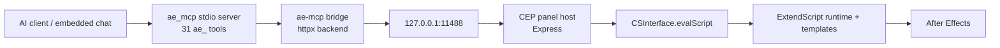

# ae-mcp 工作流 / Workflow

## 中文

这份文档描述 v0.7.0 的两条使用路径：面板内嵌 AI 对话，以及外部 MCP 客户端接入。安装和发布细节分别见根目录 README 与 [docs/RELEASE.md](RELEASE.md)。

## 1. 架构同步

```text
MCP 客户端或面板内嵌 AI
  -> packages/core (ae_mcp, Python stdio MCP server, 31 ae_ tools)
  -> backend (packages/bridge, httpx)
  -> CEP panel Node host (plugin/host, Express, 127.0.0.1:11488)
  -> CSInterface.evalScript
  -> ExtendScript (plugin/jsx/runtime.jsx + jsx_templates/*.jsx)
  -> After Effects project state
```



每一层各自负责：

- 面板内嵌 AI 或外部 MCP 客户端：发起工具调用，例如 `ae_previewFrame`、`ae_createRig`、`ae_exec`。
- `ae-mcp` / `ae_mcp`：暴露 MCP tool surface，做 schema 校验、工具 annotations、审批 gate 和 handler 路由。
- `ae-mcp-bridge`：把 handler 的 AE 调用转成对本机面板的 HTTP 请求。
- CEP panel host：常驻在 AE 内，接收 HTTP 请求并把 JSX 投给 ExtendScript。
- ExtendScript：在 AE 里真正读取项目、改图层、写表达式、创建 rig、保存 checkpoint。
- `ae-mcp-snapshot-mss`：提供跨平台截图 backend。

## 2. 面板内嵌对话

v0.7.0 面板已经是完整产品，不只是 MCP config 面板。

内嵌后端：

- Claude 订阅：默认后端。面板 spawn 系统 Node，运行 Claude Agent SDK sidecar，复用 `claude` 登录态；不落盘 API key 或 token。
- BYOK：用户提供 Anthropic API key，由面板侧 agent loop 调 Anthropic API；需要代理或兼容服务时可配置 Base URL 与自定义模型 ID。
- Codex：面板 spawn `codex app-server`。默认复用 Codex CLI 登录态；填写 Base URL / API Key / 模型 ID 后走 OpenAI-compatible 自定义 provider。

桌面端边界：

- ZCode 通过已安装应用携带的 `zcode.cjs app-server` 接入，面板驱动的是 app-server 协议，不做桌面 UI 自动化。
- Codex 通过 `codex app-server` 接入；当前没有额外的 Codex Desktop attach 协议。
- Claude 订阅通过 Claude Agent SDK sidecar 接入；Claude Desktop 仍作为外部 MCP 客户端使用。
- MCP 或面板通道不可用时，面板内 agent 应报告失败，不应切到系统截图、桌面自动化或临时 JSX 文件绕路。

Composer 选择条：

- 模型：带成本标识，会话内切换不清空对话。
- 思考深度：使用后端原生 effort 档位。
- 快速模式：后端支持时显示。
- 审批档：只读 / 手动 / 自动 / 免审。

审批语义由工具 annotations 驱动，跨 Claude 订阅、BYOK、Codex 保持一致。活动流会记录工具运行过程；kill switch 会熔断所有 AI 操作。

## 3. 首跑路径

推荐第一次按这个顺序：

1. 安装 ZXP，并打开 `Window -> Extensions -> ae-mcp`。
2. 在首跑向导中检测 `uv` 和 ae-mcp；缺失时先看命令原文，再一键安装。
3. 使用内嵌 Claude 订阅时，检测 Node >= 18、Claude CLI，并通过可见终端完成 `claude` 登录。
4. 使用内嵌 BYOK 或 Codex 自定义 provider 时，在设置里填写 API Base URL、API Key 和模型 ID。
5. 使用内嵌 Codex 官方账号时，确认 Codex CLI 已登录（`codex login`）。
6. 使用外部 MCP 客户端时，复制面板生成的 MCP config。
7. 运行连接诊断；如果外部客户端已连入，再从 `ae_ping` / `ae_overview` 开始。

```mermaid
flowchart TD
    A["Install ZXP panel"] --> B["Open Window -> Extensions -> ae-mcp"]
    B --> C["First-run wizard checks uv + ae-mcp"]
    C --> D{ "Built-in chat?" }
    D -- "Claude subscription" --> E["Check Node + Claude CLI + login"]
    D -- "BYOK / custom provider" --> F["Enter Base URL + key + model when needed"]
    D -- "Codex official" --> G["Check Codex CLI login"]
    D -- "External MCP" --> H["Copy MCP config"]
    E --> I["Run diagnostics"]
    F --> I
    G --> I
    H --> I
    I --> J["Start with ae_ping / ae_overview"]
```

首跑向导的 ae-mcp 安装命令使用 `uv tool install --from ... ae-mcp --with ...`。开发 checkout 使用本地 `packages/*` 路径；发布包使用 tag 固定的 `git+https` source。

## 4. 外部客户端

外部客户端使用 stdio MCP config：

```json
{
  "mcpServers": {
    "ae": {
      "command": "ae-mcp",
      "env": {
        "AE_MCP_BACKEND": "ae-mcp",
        "AE_MCP_PLUGIN_URL": "http://127.0.0.1:11488"
      }
    }
  }
}
```

已覆盖的客户端形态包括 Claude Desktop、Claude Code、Cursor、OpenCode、OpenClaw、AstrBot、Gemini Antigravity 等。OpenCode 在 v0.7.0 属于外部客户端，不是面板内嵌后端。

网络注意事项：

- `127.0.0.1:11488` 指的是 After Effects 所在机器。
- Claude Desktop、Claude Code、Cursor、OpenCode 这类本机客户端通常直接可用。
- OpenClaw、AstrBot 等 IM-bot 框架常驻或 Docker 化时，可能不在 AE 同机；必须保证它们能访问 AE 机器上的面板端口，或把 ae-mcp 封装到同机 runtime。

## 5. 日常使用节奏

比较稳的一条工作流是：

1. 先用只读工具建立上下文。常用：`ae_overview`、`ae_layers`、`ae_getProperties`、`ae_scanPropertyTree`。大型 comp 可给 `ae_layers` 传 `format='text'` + `offset`/`limit`。

2. 再做窄范围写操作。常用：`ae_setProperty`、`ae_applyEffect`、`ae_createLayer`、`ae_exec`。

3. 涉及表达式时先做机器校验。常用：`ae_validateExpressions`。

4. 涉及画面变化时做 preview / snapshot。常用：`ae_previewFrame`、`ae_snapshot`。

5. 风险较高的批量编辑先建回退点。常用：`ae_checkpoint`、`ae_revert`，或 `ae_exec` 的 `checkpoint_label`。

这样做的好处是：

- AI 先理解 comp 和 layer 结构，再动手。
- 表达式错误能在视觉检查前被机器发现。
- checkpoint undo 和 `emptyResult` 语义已在 v0.7.0 补齐，适合作为常规安全网。

## 6. 常见故障定位

如果工具可见但调用失败，按这个顺序排：

1. 面板是否打开，host 是否监听 `127.0.0.1:11488`。
2. `AE_MCP_PLUGIN_URL` 是否和面板端口一致。
3. 外部客户端是否能真正启动 `ae-mcp` launcher。
4. 当前 `ae-mcp` tool install 是否包含 `packages/bridge`。
5. 当前环境是否能加载 `ae-mcp-snapshot-mss`（影响 `ae_snapshot`）。
6. AE 是否有模态弹窗卡住 `evalScript`。
7. 连接诊断中的 token、Python signal、ExtendScript ping 是否通过。

如果 `ae_ping` 不通，就不要继续测高阶工具，先把链路打通。

## 7. 能力边界

v0.7.0 适合：

- 项目检查和图层分析。
- 属性修改、效果应用、表达式写入与校验。
- 快速 preview / snapshot。
- checkpoint / revert 安全迭代。
- 基础 rig 创建。
- 内嵌 AI 对话或外部 MCP 客户端驱动 AE。

仍需如实标注：

- ae-mcp 默认通过本机面板端口控制 AE；远端/Docker 客户端需要处理网络可达性。
- ZXP 是面板安装面；Python 三件套是 MCP server/backend/snapshot 安装面，两者都需要。
- 图像生成不属于 ae-mcp 工具范围；由模型或外部生成器完成，再由 AE 工具导入和操作。

## English

This document describes the two v0.7.0 usage paths: built-in AI chat inside the panel, and external MCP clients. For install and release details, see the root README and [docs/RELEASE.md](RELEASE.md).

## 1. Shared Architecture

```text
MCP client or panel-embedded AI
  -> packages/core (ae_mcp, Python stdio MCP server, 31 ae_ tools)
  -> backend (packages/bridge, httpx)
  -> CEP panel Node host (plugin/host, Express, 127.0.0.1:11488)
  -> CSInterface.evalScript
  -> ExtendScript (plugin/jsx/runtime.jsx + jsx_templates/*.jsx)
  -> After Effects project state
```


Each layer is responsible for:

- Embedded AI or external MCP client: issues tool calls such as `ae_previewFrame`, `ae_createRig`, or `ae_exec`.
- `ae-mcp` / `ae_mcp`: exposes MCP tools, schemas, tool annotations, approval gates, and handler routing.
- `ae-mcp-bridge`: turns handler-side AE requests into HTTP calls to the local panel.
- CEP panel host: stays resident inside AE, receives HTTP requests, and forwards JSX into ExtendScript.
- ExtendScript: performs project reads, layer edits, expression writes, rig creation, and checkpoints.
- `ae-mcp-snapshot-mss`: provides the cross-platform screenshot backend.

## 2. Built-In Chat

The v0.7.0 panel is a full product, not just an MCP config panel.

Embedded backends:

- Claude subscription: the default. The panel spawns system Node, runs a Claude Agent SDK sidecar, and reuses the local `claude` login without storing API keys or tokens.
- BYOK: the user provides an Anthropic API key; the panel runs its own agent loop against the Anthropic API. Compatible proxies/providers can be configured with a base URL and custom model ID.
- Codex: the panel spawns `codex app-server`. By default it reuses the Codex CLI login; with a base URL, API key, and model ID it uses an OpenAI-compatible custom provider.

Desktop boundary:

- ZCode connects through the installed app's bundled `zcode.cjs app-server`; the panel drives the app-server protocol, not desktop UI automation.
- Codex connects through `codex app-server`; there is no separate Codex Desktop attach protocol in this plugin.
- Claude subscription connects through the Claude Agent SDK sidecar; Claude Desktop remains an external MCP client path.
- If MCP or the panel channel is unavailable, the in-panel agent should report the failure instead of falling back to OS screenshots, desktop automation, or ad-hoc JSX files.

Composer controls:

- Model: cost badges, switchable inside a session without clearing the conversation.
- Reasoning effort: native effort levels from each backend.
- Fast mode: shown when supported.
- Approval mode: read-only / manual / auto / bypass.

Tool annotations drive approval behavior consistently across Claude subscription, BYOK, and Codex. The activity stream records tool execution, and the kill switch stops all AI operations.

## 3. First Run

Recommended first-run order:

1. Install the ZXP and open `Window -> Extensions -> ae-mcp`.
2. In the first-run wizard, check `uv` and ae-mcp; when missing, inspect the command preview before one-click install.
3. For built-in Claude subscription, check Node >= 18 and Claude CLI, then complete `claude` login in the visible terminal.
4. For built-in BYOK or Codex custom providers, enter API Base URL, API key, and model ID in Settings.
5. For built-in Codex official account mode, confirm Codex CLI login (`codex login`).
6. For external MCP clients, copy the MCP config generated by the panel.
7. Run diagnostics; once an external client is connected, start with `ae_ping` / `ae_overview`.

```mermaid
flowchart TD
    A["Install ZXP panel"] --> B["Open Window -> Extensions -> ae-mcp"]
    B --> C["First-run wizard checks uv + ae-mcp"]
    C --> D{ "Built-in chat?" }
    D -- "Claude subscription" --> E["Check Node + Claude CLI + login"]
    D -- "BYOK / custom provider" --> F["Enter Base URL + key + model when needed"]
    D -- "Codex official" --> G["Check Codex CLI login"]
    D -- "External MCP" --> H["Copy MCP config"]
    E --> I["Run diagnostics"]
    F --> I
    G --> I
    H --> I
    I --> J["Start with ae_ping / ae_overview"]
```

The wizard installs ae-mcp with `uv tool install --from ... ae-mcp --with ...`. Development checkouts use local `packages/*` paths; release installs use tag-pinned `git+https` sources.

## 4. External Clients

External clients use stdio MCP config:

```json
{
  "mcpServers": {
    "ae": {
      "command": "ae-mcp",
      "env": {
        "AE_MCP_BACKEND": "ae-mcp",
        "AE_MCP_PLUGIN_URL": "http://127.0.0.1:11488"
      }
    }
  }
}
```

Covered client shapes include Claude Desktop, Claude Code, Cursor, OpenCode, OpenClaw, AstrBot, Gemini Antigravity, and similar clients. OpenCode is external in v0.7.0; it is not an embedded panel backend.

Network notes:

- `127.0.0.1:11488` means the After Effects machine.
- Local clients such as Claude Desktop, Claude Code, Cursor, and OpenCode usually work directly.
- Long-running or Dockerized IM-bot frameworks such as OpenClaw and AstrBot may not be on the AE machine; they must reach the panel port on that machine, or wrap ae-mcp in a same-machine runtime.

## 5. Day-to-Day Rhythm

A stable working rhythm is:

1. Use read tools to establish context first. Common: `ae_overview`, `ae_layers`, `ae_getProperties`, `ae_scanPropertyTree`. For large comps, use `ae_layers` with `format='text'` + `offset`/`limit`.

2. Then do narrow write operations. Common: `ae_setProperty`, `ae_applyEffect`, `ae_createLayer`, `ae_exec`.

3. Machine-check expressions before visual review. Common: `ae_validateExpressions`.

4. Preview or snapshot after visible changes. Common: `ae_previewFrame`, `ae_snapshot`.

5. Add rollback points for risky edits. Common: `ae_checkpoint`, `ae_revert`, or `ae_exec` with `checkpoint_label`.

This helps because:

- The AI understands comp and layer structure before mutating it.
- Expression failures are caught before visual QA.
- Checkpoint undo and `emptyResult` semantics are delivered in v0.7.0 and are suitable as a regular safety net.

## 6. Common Failure Isolation

If tools are visible but calls fail, check in this order:

1. Is the panel open and is the host listening on `127.0.0.1:11488`?
2. Does `AE_MCP_PLUGIN_URL` match the panel port?
3. Can the external client actually launch the `ae-mcp` launcher?
4. Does the current `ae-mcp` tool install include `packages/bridge`?
5. Can the environment load `ae-mcp-snapshot-mss` for `ae_snapshot`?
6. Is a modal AE dialog blocking `evalScript`?
7. Do the diagnostics pass for token, Python signal, and ExtendScript ping?

If `ae_ping` fails, stop there and fix the connection before testing higher-level tools.

## 7. Capability Boundaries

v0.7.0 is a good fit for:

- project inspection and layer analysis
- property edits, effect application, expression writes, and validation
- fast preview / snapshot
- checkpoint / revert iteration
- basic rig creation
- AE control from built-in AI chat or external MCP clients

Still label these honestly:

- ae-mcp controls AE through a local panel port by default; remote or Dockerized clients must handle network reachability.
- ZXP is the panel install surface; the Python trio is the MCP server/backend/snapshot install surface. Both are needed.
- Image generation is outside ae-mcp's tool scope; the model or an external generator creates images, then AE tools import and manipulate them.
