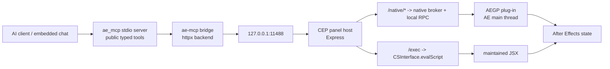

# ae-mcp 工作流 / Workflow

## 中文

这份文档描述 v0.9.2（未发布候选）的两条使用路径：面板内嵌 AI 对话，以及外部 MCP 客户端接入。同步候选版本不表示 helper、请求头路由、Tool Library 或双平台实机门禁已经完成；安装和发布条件见根目录 README 与 [docs/RELEASE.md](RELEASE.md)。

## 1. 架构同步

```text
MCP 客户端或面板内嵌 AI
  -> packages/core (ae_mcp, Python stdio MCP server, public typed tools)
  -> backend (packages/bridge, httpx)
  -> CEP panel Node host (plugin/host, Express, 127.0.0.1:11488)
     -> native broker -> local RPC -> AEGP plug-in -> AE main thread/state
     -> maintained JSX -> CSInterface.evalScript -> ExtendScript -> AE state
```



每一层各自负责：

- 面板内嵌 AI 或外部 MCP 客户端：发起工具调用，例如 `ae_previewFrame`、`ae_createRig`、`ae_exec`。
- `ae-mcp` / `ae_mcp`：暴露 MCP tool surface，做 schema 校验、工具 annotations、审批 gate 和 handler 路由。
- `ae-mcp-bridge`：把 handler 的 AE 调用转成对本机面板的 HTTP 请求。
- CEP panel host：常驻在 AE 内，按固定端点执行请求：`/native/*` 进入原生 broker，`/exec` 进入 JSX。实现绑定由 Core/public handler 显式定义；当前不存在运行时 AEGP/JSX resolver，也不会在原生失败后自动 fallback。
- AEGP plug-in：通过本地 native RPC 在 AE 主线程读取或修改真实 AE 状态，并返回原生 provenance、审计和可验证后置条件。
- ExtendScript：承担仍由 maintained JSX 实现的能力；它不是原生 AEGP 执行证据，也不会自动替代失败的原生调用。
- `ae-mcp-snapshot-mss`：提供跨平台截图 backend。

v0.9.2 的普通用户路径只使用同一个 candidate SHA 生成的离线平台资产：

| 平台 | 安装资产 | 同组审计载荷 |
|---|---|---|
| macOS arm64 | `ae-mcp-panel-v0.9.2-macos-arm64.dmg` | `ae-mcp-panel-v0.9.2-macos-arm64.zxp` |
| Windows x64 | `ae-mcp-panel-v0.9.2-windows-x64.zxp` | 同一个 ZXP |

两端最终都按 `artifact-manifest-v0.9.2.json` 验证；获批后的 RuntimeManager 契约要求 Panel 从包内安装 runtime，首跑不联网解析 Python/Node 依赖。当前 build guard 在该实现缺失时保持关闭。

### Attestation Check provenance（外部前置）

attestation workflow 生成的 Check 属于同仓库 workflow 共享的 GitHub Actions App（固定校验 App ID `15368` 与 slug `github-actions`），该 App 身份本身不能证明写入一定来自 `.github/workflows/attestation.yml`。因此，正式发布的外部前置条件是：组织/仓库 Actions 策略、protected `main` 评审和权限审计必须阻止不受信任的同仓库 workflow 获得 `checks:write`。新增或修改具有 `checks:write` 的 workflow 必须按发布信任边界评审；若无法证明这一限制，attestation Check 不得作为发布授权。

## 2. 面板内嵌对话

v0.9.2 候选沿用完整面板产品形态，不只是 MCP config 面板；这里描述最终契约，不代表未获批准或未验收的能力已经完成。

内嵌后端与凭证通道：

- Claude：可选 Claude Code CLI 订阅通道复用 `claude` 登录态；API 直连通道使用 Anthropic API key 或兼容 provider，不依赖该 CLI。
- Codex：可选 Codex CLI 通道可复用登录态或继承 `~/.codex/config.toml`；也可使用 Provider 管理器中的 OpenAI-compatible provider。
- ZCode：可选 ZCode CLI/app-server 通道使用受支持安装携带的 `zcode.cjs`；API-key provider 与它分离，面板不做桌面 UI 自动化。
- 设置页以 Claude / Codex / ZCode 三路分段控件组织后端，每路后端显示凭证通道卡；可自动按优先级选择，也可手动锁定某条通道。Provider 管理器负责本机 `~/.ae-mcp/providers.json` 中的 OpenAI-compatible 与 Anthropic provider。

桌面端边界：

- ZCode `*-start-plan` 官方托管计划所需 captcha/runtime headers 只在桌面 Electron renderer 内生成，桌面应用不暴露本地 API，面板检测到有效凭据前不可选。
- Codex 通过 `codex app-server` 接入；当前没有额外的 Codex Desktop attach 协议。
- Claude 订阅通过 Claude Agent SDK sidecar 接入；Claude Desktop 仍作为外部 MCP 客户端使用。
- MCP 或面板通道不可用时，面板内 agent 应报告失败，不应切到系统截图、桌面自动化或临时 JSX 文件绕路。

Composer 选择条：

- 模型：带成本标识，会话内切换不清空对话。
- 思考深度：使用后端原生 effort 档位。
- 快速模式：后端支持时显示。
- 审批档：只读 / 手动 / 自动 / 免审。

审批语义由工具 annotations 驱动，跨 Claude、Codex、ZCode 保持一致。活动流会记录工具运行过程；kill switch 会熔断所有 AI 操作。

## 3. 首跑路径

推荐第一次按这个顺序：

1. 下载并校验当前平台的 v0.9.2 资产；Mac 挂载 DMG 并用另行提供的受支持 ZXP installer 安装其中的 ZXP，Windows 也用受支持的 ZXP installer 安装 ZXP，然后打开 `Window -> Extensions -> ae-mcp`。
2. 最终首跑向导必须验证并离线安装包内 runtime，确认稳定 `ae-mcp` launcher 可用；普通用户不安装 `uv`、系统 Python 或系统 Node。
3. 使用内嵌 Claude 订阅时，检测可选 Claude Code CLI，并通过可见终端完成 `claude` 登录。
4. 使用 Claude API 直连、Codex 自定义 provider 或 ZCode API key provider 时，在 Provider 管理器或对应通道卡中填写 Base URL、API Key 和模型 ID。
5. 使用内嵌 Codex 官方账号时，确认 Codex CLI 已登录（`codex login`）。
6. 使用外部 MCP 客户端时，复制面板生成的 MCP config。
7. 运行连接诊断；如果外部客户端已连入，再从 `ae_ping` / `ae_overview` 开始。

```mermaid
flowchart TD
    A["Verify and install platform asset"] --> B["Open Window -> Extensions -> ae-mcp"]
    B --> C["Verify bundled runtime + stable launcher"]
    C --> D{ "Built-in chat?" }
    D -- "Claude subscription" --> E["Check Node + Claude CLI + login"]
    D -- "API direct / custom provider" --> F["Enter Base URL + key + model when needed"]
    D -- "Codex official" --> G["Check Codex CLI login"]
    D -- "External MCP" --> H["Copy MCP config"]
    E --> I["Run diagnostics"]
    F --> I
    G --> I
    H --> I
    I --> J["Start with ae_ping / ae_overview"]
```

首跑向导只校验、复制并原子激活发布资产内的 runtime。`uv`、pip/npm 解析与本地 `packages/*` 只属于开发 checkout，不是 release 用户路径；v0.9.3 macOS RuntimeManager 已实现这条离线路径。

## 4. 外部客户端

外部客户端使用 stdio MCP config：

```json
{
  "mcpServers": {
    "ae": {
      "command": "/Users/<USER>/.ae-mcp/bin/ae-mcp",
      "env": {
        "AE_MCP_BACKEND": "ae-mcp",
        "AE_MCP_PLUGIN_URL": "http://127.0.0.1:11488"
      }
    }
  }
}
```

上例是稳定 launcher 契约。v0.9.3 macOS Panel 输出展开后的绝对路径，RuntimeManager 在启动前校验 active runtime，且不会回退到裸 PATH；Windows v0.9.2 行为保持不变。

已覆盖的客户端形态包括 Claude Desktop、Claude Code、Cursor、OpenCode、OpenClaw、AstrBot、Gemini Antigravity 等。OpenCode 在 v0.7.0 属于外部客户端，不是面板内嵌后端。

网络注意事项：

- `127.0.0.1:11488` 指的是 After Effects 所在机器。
- Claude Desktop、Claude Code、Cursor、OpenCode 这类本机客户端通常直接可用。
- OpenClaw、AstrBot 等 IM-bot 框架常驻或 Docker 化时，可能不在 AE 同机；必须保证它们能访问 AE 机器上的面板端口，或把 ae-mcp 封装到同机 runtime。

## 5. 日常使用节奏

比较稳的一条工作流是：

1. 先用只读工具建立上下文。常用：`ae_overview`、`ae_layers`、`ae_getProperties`、`ae_scanPropertyTree`。大型 comp 可给 `ae_layers` 传 `format='text'` + `offset`/`limit`。

   原生 AEGP 开发验证使用独立的一次性工程：先调用 `ae_getProjectBitDepth {}` 记录初始值，再选择一个
   与初始值不同的 `8/16/32` 目标，用唯一 `idempotency_key` 调用 `ae_setProjectBitDepth`，随后再次只读确认。
   响应中的 `undo.available=true` 不等于已经执行 Undo；真实 Undo/Redo 必须另行操作并用只读工具核对。

2. 再做窄范围写操作。常用：`ae_setProperty`、`ae_applyEffect`、`ae_createLayer`、`ae_exec`。

3. 涉及表达式时先做机器校验。常用：`ae_validateExpressions`。

4. 涉及画面变化时做 preview / snapshot。常用：`ae_previewFrame`、`ae_snapshot`。

5. 风险较高的批量编辑先建回退点。常用：`ae_checkpoint`、`ae_revert`，或 `ae_exec` 的 `checkpoint_label`。

这样做的好处是：

- AI 先理解 comp 和 layer 结构，再动手。
- 表达式错误能在视觉检查前被机器发现。
- checkpoint undo 和 `emptyResult` 语义已在 v0.7.0 补齐，适合作为常规安全网。

## 6. Tool Library 渐进工作流

不要把完整制品库一次塞进模型上下文。execute/apply 操作使用固定顺序：

```text
ae_toolIndex
  -> ae_toolSearch
  -> ae_toolInspect
  -> ae_toolUse(action="prepare")
  -> ae_toolUse(action="grant")
  -> ae_toolUse(action="execute")
```

Index/Search 只含摘要；Inspect 才读取完整、按 user-untrusted 处理的 content。只渲染、不执行时，在 Inspect 后调用 `ae_toolUse(action="render")`，不需要 grant。candidate、archived、deprecated 不能执行；history candidate 用 `ae_toolPromoteFromHistory` 保存，imported candidate 用 `ae_toolEdit` 将 status 改为 saved，操作前都应检查内容。Prepare 后不要改制品、参数 schema、target 或 recipe/handler 依赖；任何变化都会让旧 `planHash`/grant 失效。grant 只能消费一次，destructive/external 不提供 session 放行。

start/execute 必须携带稳定的 `operation_id`；相同 operation ID 只用于同一 `planHash` 的网络重试或跨 Core 恢复。共享 Tool Library 的 Core 会原子预约该标识，未持有预约的进程返回已有 execution 而不会再次执行；不同计划会明确冲突。`outcome-unknown` 不能自动重试，应先用 status/history、AE 状态和审计记录核对副作用。

## 7. 常见故障定位

如果工具可见但调用失败，按这个顺序排：

1. 面板是否打开，host 是否监听 `127.0.0.1:11488`。
2. `AE_MCP_PLUGIN_URL` 是否和面板端口一致。
3. 外部客户端是否能真正启动 `ae-mcp` launcher。
4. 当前 runtime manifest 是否包含并校验通过 core、bridge 与 snapshot payload。
5. 当前环境是否能加载 `ae-mcp-snapshot-mss`（影响 `ae_snapshot`）。
6. AE 是否有模态弹窗卡住 `evalScript`。
7. 连接诊断中的 token、Python signal、ExtendScript ping 是否通过。

如果 `ae_ping` 不通，就不要继续测高阶工具，先把链路打通。

## 8. 能力边界

v0.9.2 候选的最终能力边界适合：

- 项目检查和图层分析。
- 属性修改、效果应用、表达式写入与校验。
- 快速 preview / snapshot。
- checkpoint / revert 安全迭代。
- 基础 rig 创建。
- 内嵌 AI 对话或外部 MCP 客户端驱动 AE。

仍需如实标注：

- ae-mcp 默认通过本机面板端口控制 AE；远端/Docker 客户端需要处理网络可达性。
- 平台资产同时携带 CEP 面板与已锁定的 MCP/runtime payload；不要再把在线 Python 三件套当作普通用户的第二安装面。
- 图像生成不属于 ae-mcp 工具范围；由模型或外部生成器完成，再由 AE 工具导入和操作。

## English

This document describes the two v0.9.2 (unreleased candidate) usage paths: built-in AI chat inside the panel and external MCP clients. Candidate version synchronization does not assert that the helper, provider route, Tool Library, or dual-platform hardware gates are complete. See the root README and [docs/RELEASE.md](RELEASE.md) for install and release prerequisites.

## 1. Shared Architecture

```text
MCP client or panel-embedded AI
  -> packages/core (ae_mcp, Python stdio MCP server, public typed tools)
  -> backend (packages/bridge, httpx)
  -> CEP panel Node host (plugin/host, Express, 127.0.0.1:11488)
     -> native broker -> local RPC -> AEGP plug-in -> AE main thread/state
     -> maintained JSX -> CSInterface.evalScript -> ExtendScript -> AE state
```


Each layer is responsible for:

- Embedded AI or external MCP client: issues tool calls such as `ae_previewFrame`, `ae_createRig`, or `ae_exec`.
- `ae-mcp` / `ae_mcp`: exposes MCP tools, schemas, tool annotations, approval gates, and handler routing.
- `ae-mcp-bridge`: turns handler-side AE requests into HTTP calls to the local panel.
- CEP panel host: stays resident inside AE and follows fixed endpoints: `/native/*` enters the native broker and `/exec` enters JSX. Core/public handlers bind implementations explicitly; there is no runtime AEGP/JSX resolver or automatic fallback after a native failure.
- AEGP plug-in: uses local native RPC and the AE main thread to read or mutate real AE state, returning native provenance, audit, and verifiable postconditions.
- ExtendScript: implements capabilities that remain maintained JSX; it is not native AEGP evidence and is not an automatic fallback for a failed native call.
- `ae-mcp-snapshot-mss`: provides the cross-platform screenshot backend.

The normal-user v0.9.2 path uses only offline platform assets built from the same candidate SHA:

| Platform | Install asset | Same-set audit payload |
|---|---|---|
| macOS arm64 | `ae-mcp-panel-v0.9.2-macos-arm64.dmg` | `ae-mcp-panel-v0.9.2-macos-arm64.zxp` |
| Windows x64 | `ae-mcp-panel-v0.9.2-windows-x64.zxp` | the same ZXP |

Both final assets are verified against `artifact-manifest-v0.9.2.json`. The approved RuntimeManager contract requires the Panel to install the bundled runtime without resolving Python/Node dependencies over the network. The current build guard stays closed while that implementation is absent.

### Attestation Check Provenance (External Prerequisite)

Checks created by the attestation workflow belong to the GitHub Actions App shared by workflows in the same repository (the workflow verifies App ID `15368` and slug `github-actions`). That shared App identity does not prove that a write came specifically from `.github/workflows/attestation.yml`. An external prerequisite for release is therefore an organization/repository Actions policy, protected-`main` review, and permission audit that prevent untrusted same-repository workflows from receiving `checks:write`. Every workflow addition or change with `checks:write` requires release-trust review; if this restriction cannot be demonstrated, an attestation Check is not release authorization.

## 2. Built-In Chat

The v0.9.2 candidate retains the full Panel product shape, not just MCP configuration. This section describes the final contract; it does not claim unapproved or unverified work is complete.

Embedded backends and credential channels:

- Claude: the optional Claude Code CLI subscription channel reuses the `claude` login; API direct uses an Anthropic API key or compatible provider without that CLI.
- Codex: the optional Codex CLI channel can reuse login/config state; an OpenAI-compatible provider remains a separate route.
- ZCode: the optional ZCode CLI/app-server channel uses `zcode.cjs` from a supported installation; API-key providers are separate, and the Panel does not automate desktop UI.
- Settings organize the built-in AI service as Claude / Codex / ZCode. Each backend displays credential-channel cards with priority-based automatic selection and optional manual channel locking. Provider Manager owns local OpenAI-compatible and Anthropic providers in `~/.ae-mcp/providers.json`.

Desktop boundary:

- ZCode `*-start-plan` official hosted plans need captcha/runtime headers generated only inside the desktop Electron renderer, and the desktop app exposes no local API for them, so they stay unavailable until the panel detects valid credentials.
- Codex connects through `codex app-server`; there is no separate Codex Desktop attach protocol in this plugin.
- Claude subscription connects through the Claude Agent SDK sidecar; Claude Desktop remains an external MCP client path.
- If MCP or the panel channel is unavailable, the in-panel agent should report the failure instead of falling back to OS screenshots, desktop automation, or ad-hoc JSX files.

Composer controls:

- Model: cost badges, switchable inside a session without clearing the conversation.
- Reasoning effort: native effort levels from each backend.
- Fast mode: shown when supported.
- Approval mode: read-only / manual / auto / bypass.

Tool annotations drive approval behavior consistently across Claude, Codex, and ZCode. The activity stream records tool execution, and the kill switch stops all AI operations.

## 3. First Run

Recommended first-run order:

1. Download and verify the v0.9.2 platform asset. On Mac, mount the DMG and install its ZXP with a separately supplied supported ZXP installer; use a supported ZXP installer for the Windows ZXP too. Then open `Window -> Extensions -> ae-mcp`.
2. The final first-run wizard must verify and install the bundled runtime offline, then confirm the stable `ae-mcp` launcher. Normal users do not install `uv`, system Python, or system Node.
3. For built-in Claude subscription, check the optional Claude Code CLI and complete `claude` login in the visible terminal.
4. For Claude API direct, Codex custom providers, or ZCode API-key providers, enter Base URL, API key, and model ID in Provider Manager or the relevant channel card.
5. For built-in Codex official account mode, confirm Codex CLI login (`codex login`).
6. For external MCP clients, copy the MCP config generated by the panel.
7. Run diagnostics; once an external client is connected, start with `ae_ping` / `ae_overview`.

```mermaid
flowchart TD
    A["Verify and install platform asset"] --> B["Open Window -> Extensions -> ae-mcp"]
    B --> C["Verify bundled runtime + stable launcher"]
    C --> D{ "Built-in chat?" }
    D -- "Claude subscription" --> E["Check Node + Claude CLI + login"]
    D -- "API direct / custom provider" --> F["Enter Base URL + key + model when needed"]
    D -- "Codex official" --> G["Check Codex CLI login"]
    D -- "External MCP" --> H["Copy MCP config"]
    E --> I["Run diagnostics"]
    F --> I
    G --> I
    H --> I
    I --> J["Start with ae_ping / ae_overview"]
```

The first-run wizard only verifies, copies, and atomically activates the runtime already inside the release asset. `uv`, pip/npm resolution, and local `packages/*` are development-checkout concerns, not the release-user path. The v0.9.3 macOS RuntimeManager implements this offline path.

## 4. External Clients

External clients use stdio MCP config:

```json
{
  "mcpServers": {
    "ae": {
      "command": "/Users/<USER>/.ae-mcp/bin/ae-mcp",
      "env": {
        "AE_MCP_BACKEND": "ae-mcp",
        "AE_MCP_PLUGIN_URL": "http://127.0.0.1:11488"
      }
    }
  }
}
```

This is the stable-launcher contract. The v0.9.3 macOS Panel emits the expanded absolute path, RuntimeManager verifies the active runtime before spawn, and `ae-mcp` never falls back to bare PATH. Windows v0.9.2 behavior remains unchanged.

Covered client shapes include Claude Desktop, Claude Code, Cursor, OpenCode, OpenClaw, AstrBot, Gemini Antigravity, and similar clients. OpenCode is external in v0.7.0; it is not an embedded panel backend.

Network notes:

- `127.0.0.1:11488` means the After Effects machine.
- Local clients such as Claude Desktop, Claude Code, Cursor, and OpenCode usually work directly.
- Long-running or Dockerized IM-bot frameworks such as OpenClaw and AstrBot may not be on the AE machine; they must reach the panel port on that machine, or wrap ae-mcp in a same-machine runtime.

## 5. Day-to-Day Rhythm

A stable working rhythm is:

1. Use read tools to establish context first. Common: `ae_overview`, `ae_layers`, `ae_getProperties`, `ae_scanPropertyTree`. For large comps, use `ae_layers` with `format='text'` + `offset`/`limit`.

   Native AEGP development qualification uses a disposable project: call
   `ae_getProjectBitDepth {}` for the baseline, choose a different `8/16/32`
   target, invoke `ae_setProjectBitDepth` with a unique `idempotency_key`, then
   read again. `undo.available=true` does not mean Undo
   was executed; real Undo/Redo must be performed separately and checked with
   the read tool.

2. Then do narrow write operations. Common: `ae_setProperty`, `ae_applyEffect`, `ae_createLayer`, `ae_exec`.

3. Machine-check expressions before visual review. Common: `ae_validateExpressions`.

4. Preview or snapshot after visible changes. Common: `ae_previewFrame`, `ae_snapshot`.

5. Add rollback points for risky edits. Common: `ae_checkpoint`, `ae_revert`, or `ae_exec` with `checkpoint_label`.

This helps because:

- The AI understands comp and layer structure before mutating it.
- Expression failures are caught before visual QA.
- Checkpoint undo and `emptyResult` semantics are delivered in v0.7.0 and are suitable as a regular safety net.

## 6. Progressive Tool Library Workflow

Do not inject the full artifact library into model context. Execute/apply operations use this fixed sequence:

```text
ae_toolIndex
  -> ae_toolSearch
  -> ae_toolInspect
  -> ae_toolUse(action="prepare")
  -> ae_toolUse(action="grant")
  -> ae_toolUse(action="execute")
```

Index/Search contain summaries only; Inspect is the first call that reads full content, which remains user-untrusted. For rendering without execution, call `ae_toolUse(action="render")` after Inspect; no grant is required. Candidate, archived, and deprecated artifacts cannot execute. Save history candidates with `ae_toolPromoteFromHistory`; save imported candidates by changing status to saved with `ae_toolEdit`, inspecting content before either operation. After Prepare, do not change content, argument schema, target, or recipe/handler dependencies: any change invalidates the old `planHash` and grant. Grants are one-time, and destructive/external plans never offer session approval.

Start/execute requests must carry a stable `operation_id`; reuse an operation ID only for network retries or cross-Core recovery of the same `planHash`. Cores sharing a Tool Library atomically reserve the identifier, and a non-owner returns the existing execution without dispatching again; a different plan fails with an explicit conflict. Never auto-retry `outcome-unknown`: reconcile status/history, AE state, and audit evidence first.

## 7. Common Failure Isolation

If tools are visible but calls fail, check in this order:

1. Is the panel open and is the host listening on `127.0.0.1:11488`?
2. Does `AE_MCP_PLUGIN_URL` match the panel port?
3. Can the external client actually launch the `ae-mcp` launcher?
4. Does the runtime manifest include and verify core, bridge, and snapshot payloads?
5. Can the environment load `ae-mcp-snapshot-mss` for `ae_snapshot`?
6. Is a modal AE dialog blocking `evalScript`?
7. Do the diagnostics pass for token, Python signal, and ExtendScript ping?

If `ae_ping` fails, stop there and fix the connection before testing higher-level tools.

## 8. Capability Boundaries

The final v0.9.2 candidate boundary is a good fit for:

- project inspection and layer analysis
- property edits, effect application, expression writes, and validation
- fast preview / snapshot
- checkpoint / revert iteration
- basic rig creation
- AE control from built-in AI chat or external MCP clients

Still label these honestly:

- ae-mcp controls AE through a local panel port by default; remote or Dockerized clients must handle network reachability.
- A platform asset carries both the CEP Panel and locked MCP/runtime payload; do not treat an online Python trio as a second normal-user install surface.
- Image generation is outside ae-mcp's tool scope; the model or an external generator creates images, then AE tools import and manipulate them.
